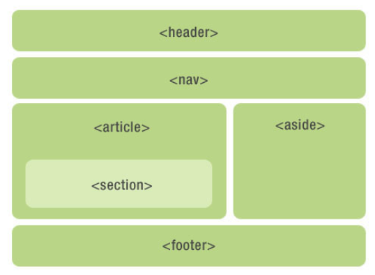
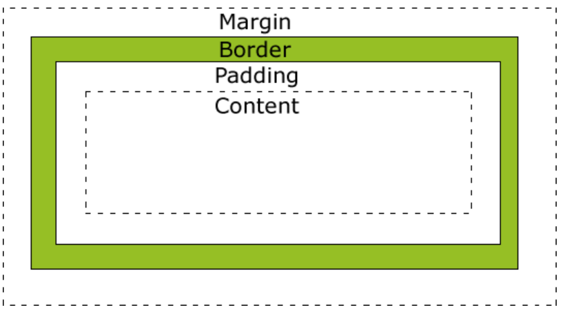
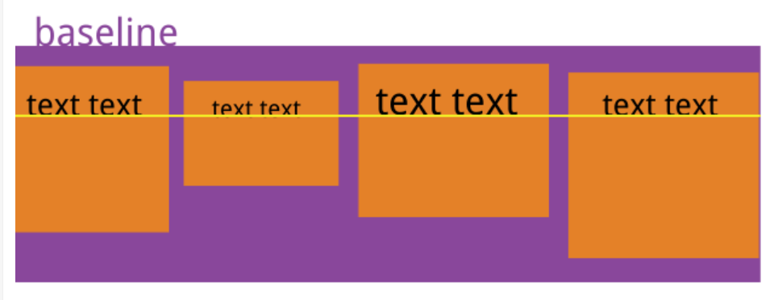
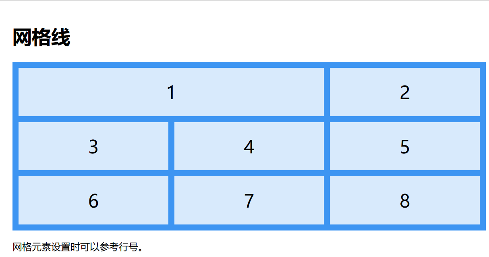
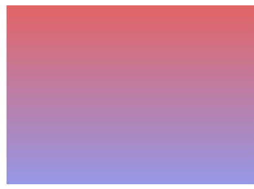
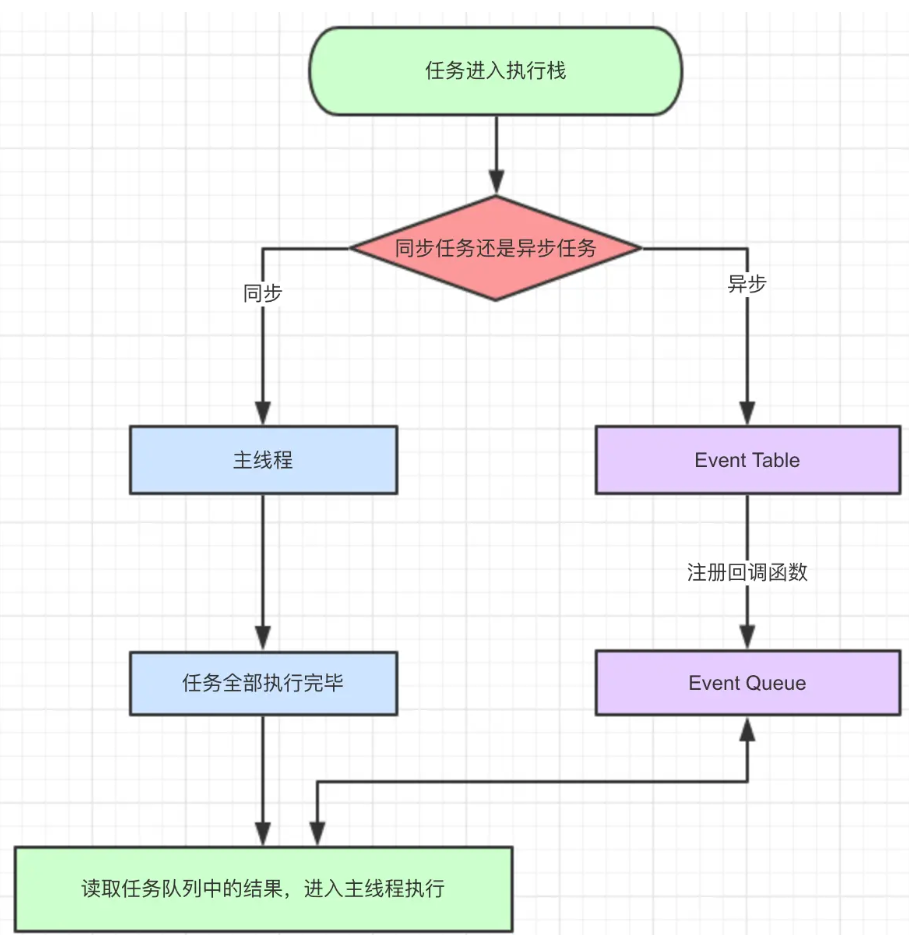

# 小橙编程学习宝典  
>
> ***XiaoCheng Programming Learning Book***
>

## ⭐️ HTML5新特性  

1. 语义化标签  
    
2. 浏览器支持  
3. 多媒体标签  
    + **embed**(视频、音频 不支持移动端)  
    + **video**(视频 PC与移动兼容)
4. Canvas 画布  （脚本绘制图形）\<canvas> 画布
5. ❌ 内联 SVG  （质量不下降的可伸缩矢量图形）
6. 本地(Web)存储
    + localStorage - 长久保存整个网站的数据，保存的数据没有过期时间，直到手动去除。  
    + sessionStorage - 临时保存同一窗口的数据，在关闭窗口后将删除这些数据。
7. ❌ Web SQL  
8. Web Workers
   + 运行在后台的 JavaScript，独立于其他脚本，不会影响页面的性能  
9. 应用缓存（Cache Manifest）  
    + ***\<html manifest="demo.appcache">*** 离线访问,速度快减少服务器负载
10. 地理定位  ***getCurrentPosition()*** 
11. 拖放  

## ⭐️ CSS

### 选择器

+ 元素(p)、类(class)、id(#)、通配(*)、属性 **(input[type="text"** 分组 (",") 选择器
+ 后代组合器 ===> ***div p***  (选得到孙代、曾孙等)
+ 子代组合器 ===> ***div > p*** (只有子代)
+ 一般兄弟组 ===> ***div ~ p*** (同一类别，共享同一父节点)
+ 紧跟兄弟组 ===> ***div + p*** (紧跟在后面的) 
+ 伪类(样式化一个元素的特定状态)
   >
   >***a:link*** =====> 未访问的链接  
   >***a:visited*** ===> 已访问的链接  
   >***a:hover*** ====>鼠标划过链接  
   >***a:active*** ====>已选中的链接  
   >
+ 伪元素(选择一个元素的某个部分而不是元素自己) ===>***p::first-line***
  
### 文档流

+ 标准流 ===> 一行接一行,每一行从左至右
+ 浮动流 ***.float*** ===> 水平排版形式，左、右对齐
+ 定位流(position)
   > 相对定位 relative  ==== 相对本身定位  
   > 绝对定位 absolute  === 相对于已定位的父元素定位  
   > 固定定位 fixed  ===== 相对于浏览器窗口(一般用于侧边栏UI)  
   > 静态定位 static  
   > 粘性定位 sticky ==== 依赖用户的滚动，超出指定位置就固定
+ 脱离文档流 : ***float*** <===> ***position:absolute/fixed***
  
### ⭐️ 内联元素 / 块状元素

+ inline元素————\<span> 默认水平排列 ⭐***不能用width指定***
+ block元素————\<div> 默认充满整个屏幕 可以通过display:inline;变成内联元素
   > 给block设置高度后，文字超出高度  
   > ***overflow:hidden*** 干脆就直接让超出的内容隐藏了  
   > ***overflow:auto*** 不超出时，正常显示，超出时，就出现滚动条

### ⭐️ 盒子模型

   

### ⭐️⭐️⭐️ 层叠规则

### CSS3

#### 响应式布局

页面的设计与开发根据用户行为以及设备环境(系统平台、屏幕尺寸、屏幕定向等)进行相应的响应和调整。

+ 媒体查询：`@media screen and (max-width: 600px)` 小屏幕上调整

##### Flex 布局

子元素的float、clear和vertical-align属性将失效

1. `flex-direction`属性：
   + `row`：主轴为水平方向(左--->右)
   + `row-reverse`：主轴为反方向(右--->左)
   + `column`：主轴为垂直方向(上--->下)
   + `column-reverse`：主轴为垂直方向(下--->上)

2. `flex-wrap`属性：
   + `nowrap`：不换行
   + `wrap`：换行,往下换
   + `wrap-reverse`：换行，往上换
3. `flex-flow`属性
   > flex-direction属性和flex-wrap属性的简写形式，默认为row nowrap。
4. `justify-content`属性===(定义了项目在主轴上的对齐方式)
   > `flex-start`（默认值）：左对齐  
   > `flex-end`：右对齐  
   > `center`： 居中  
   > `space-between`：两端对齐，项目之间的间隔都相等。  
   > `space-around`：每个项目两侧的间隔相等。
5. `align-items`属性===(定义项目在交叉轴上如何对齐)
   > `stretch`（默认值）：项目未设置高度或设为auto，占满整个容器的高度
   > `flex-start`：交叉轴的起点对齐  
   > `flex-end`：终点对齐  
   > `center`：中点对齐  
   > `baseline`: 项目的第一行文字的基线对齐
   >

6. 项目属性
   > `order` ========= 数值越小越靠前(0)  
   > `flex-grow` ====== 放大比例(0)  
   > `flex-shrink` ====== 缩小比例(1)  
   > `flex-basis` ====== 定义在分配多余空间前，项目占据的主轴空间  
   > `flex` ========== flex-grow, flex-shrink 和 flex-basis的简写，默  为(0 1 auto)快捷---> auto (1 1 auto) 和 none (0 0 auto)  
   > `align-self` ====== 允许单个项目有与其他项目不一样的对齐方式

##### Grid 布局

1. 网格轨道  `grid-template-columns`与`grid-template-rows`
   > *A*  
   > `grid-template-columns`: ***auto auto auto auto***;  
   > `grid-template-rows`: ****100px 300px***;  
   > ***fr***：一个 fr 单位代表网格容器中可用空间的一等份
2. 网格间距
   > `grid-column-gap` === 列间隔  
   > `grid-gap`  =========行间隔  
   > `grid-row-gap` ======二者简写  
3. 网格线
   > .item1 {  
         grid-column-start: 1;  
         grid-column-end: 3;  
         }
   >


##### 瀑布流

   多行等宽元素排列,在手机端进行多图片展示,等宽不等高

#### 动画

```CSS  
# 创建动画（渐变色）
@keyframes myfirst {  
   from {background: red;}  
   to {background: yellow;}  
}

# 动画要绑定到一个选择器
div
{
    animation: myfirst 5s;
    -webkit-animation: myfirst 5s; /* Safari 与 Chrome */
}

# 百分比变色
@keyframes myfirst
{
    0%   {background: red;}
    25%  {background: yellow;}
    50%  {background: blue;}
    100% {background: green;}
}

# 变色和位置
@keyframes myfirst
{
    0%   {background: red; left:0px; top:0px;}
    25%  {background: yellow; left:200px; top:0px;}
    50%  {background: blue; left:200px; top:200px;}
    75%  {background: green; left:0px; top:200px;}
    100% {background: red; left:0px; top:0px;}
}
```

#### 过渡

元素从一种样式逐渐改变为另一种的效果

```CSS
# 应用过渡效果2s  控制调用内容和时长
div {
   width:100px;
   height:100px;
   background:red;
   transition:width 2s;  }
# 鼠标悬停时触发   控制最终效果
div:hover {
    width:300px;   }

# 多项改变
transition: width 2s, height 2s, transform 2s;
```

#### 渐变

在颜色之间平稳的过渡

+ 线性渐变 - 向下/向上/向左/向右/对角方向  
+ 径向渐变 - 由它们的中心定义

```CSS
1.线性
# 默认从上到下
#grad1 {
   height: 200px;
   background-color: red; /* 浏览器不支持时显示 */
   background-image: linear-gradient(#e66465, #9198e5);
}
# 从左到右
linear-gradient(to right, red , yellow)

# 左上到右下
(to bottom right, red, yellow)

2.径向
# 角度
background-image: linear-gradient(-90deg, red, yellow);
```



#### 背景

> background-image ====> 添加背景图片  
> background-size =====> 背景图片大小 px与%  
> background-origin ====> 位置区域  
> |||||||| content-box, padding-box,和 border-box区域内可以放置背景图像|||||  
> background-clip =====> 剪裁属性:从指定位置开始绘制  

#### 边框

> border-radius 圆角  
> box-shadow 阴影（10px 10px 5px #888888）  
  
> border-image 边界图片   


#### 圆角

```CSS
# 纯色做圆角填充
#rcorners1 {
    border-radius: 25px;
    background: #8AC007;
}
# 指定边框
#rcorners2 {
    border-radius: 25px;
    border: 2px solid #8AC007;
}
# 指定图片
#rcorners3 {
    border-radius: 25px;
    background: url(paper.gif);
    background-position: left top;
    background-repeat: repeat;
}
# 指定每一个角
border-radius: 15px 50px 30px 5px:  顺时针从左上开始编号1.2.3.4
四个值 -  | 1 | 2 | 3 | 4 |
三个值 -  | 1 |  2.4  | 3 |
两个值 -  |1.3| 2.4 |
一个值 - 全部一样

# 椭圆边角
border-radius: 50px/15px
```

#### 字体

```CSS
<style> 
@font-face
{
   # 字体名称
   font-family: myFirstFont;  
   src: url(sansation_light.woff);
   # 粗体文本
   font-weight:bold;
}
 
div
{
    font-family:myFirstFont;
}
</style>
```

#### 2D / 3D 转换

2D转换
>translate() 平移 ====> transform: translate(50px,100px);  
>rotate() 旋转 =====> transform: rotate(30deg);  
>scale() 缩放 ======> transform: scale(2,3);  
>skew() 倾斜 ======> transform: skew(30deg,20deg);  
>matrix() 六个参数的矩阵，包含旋转，缩放，移动（平移）和倾斜功能。

3D转换
> rotateX() ===> transform: rotateX(120deg);  
> rotateY() ===> transform: rotateY(130deg);

---
  
## ⭐️JavaScript  

### Dom中的innerHTML属性

   > \<div id="demo">    \</div>  中间的值  
   ***document.getElementById("demo").innerHTML***

### ⭐️ 数据类型

+ 未定义 Undefined
  + 未定义的变量var t1;
   > t1===undefined  
   任何变量都可以通过设置值为 undefined 来清空  
   >
+ **Symbol(一个永远不会重复的字符串)**

+ 返回类型：  
   > 1.typeof +数据  
   > 2.数据.constuctor  
   >
   ⭐️判断是否为各种类型：  
   > return 数据.constructor.toString().indexOf("类型") > -1

+ ✅ 数据类型转换

  + 字符类型转换：
      > 1.====> String()  
      > 2.====> .toString
  + 字符、布尔值、日期转数字:  ***Number()*** || ***getTime()***
  + 一元运算符 "+"
      > ***将"5" 转换成数字 5***
      > 若变量不可转换，则类型为Number,但值为NaN(非数字)

### ⭐️ 函数function

#### 调用方式

+ ⭐️ 全局调用

```js
function myFunction() {
    return this;
}
myFunction();      // 返回 window 对象
```

+ 函数作为方法调用
  
```js
var myObject = {
    firstName:"John",
    lastName: "Doe",
    fullName: function () {return this;}}
myObject.fullName();          // 返回 [object Object] (所有者对象)
```

+ 构造函数调用  

```Js
// 构造函数:
function myFunction(arg1, arg2) {
    this.firstName = arg1;
    this.lastName  = arg2;}
var x = new myFunction("John","Doe");
x.firstName;                             // 返回 "John"
```

+ ⭐️ 函数方法调用
   > apply 和 call 用于调用函数,第一个参数必须是对象本身
   >
   ***区别*** ：apply传入一个数组，call作为参数传入

```js
# call
      function myFunction(a, b) {return a * b;}
      myObject = myFunction.call(myObject, 10, 2);     // 返回 20
# apply
      myArray = [10, 2];
      myObject = myFunction.apply(myObject, myArray);  // 返回 20
```

+ ❗ 闭包
  
```Js
var add = (function () {
    var counter = 0;
    return function () {return counter += 1;}
})();
 
add();
add();
add();   //计数器结果为3

# 分析：
立即执行函数(function(){  })(), 由于return的是另一个function(),
所以在执行一次后,就变成 var add = (function(){return counter += 1})
而counter=0就执行一次,且每次都会访问局部变量counter，counter也不会重置，
一直保留数据
```

### ✅ 对象

  原型链和继承
  
+ 每个对象（object）都有一个私有属性指向另一个名为原型（prototype）的对象。原型对象也有一个自己的原型，层层向上直到一个对象的原型为 null。 

```js
const parent = {
  value: 2,
  method() {
    return this.value + 1;
  },};
// this指向了 parent
console.log(parent.method()); // 3


// child继承parent
const child = {
  __proto__: parent,
};
console.log(child.method()); // 3
// 调用 child.method 时，“this”指向了 child,没有就找原型的

// 遮蔽 value从3变成4，相当于“重写”
child.value = 4; 
console.log(child.method()); // 5
```

### ✅ 作用域（作用域链）

作用域的集合就是作用域链 [scope]  
1、函数在执行的过程中，先从自己内部寻找变量  
2、找不到，再从创建当前函数所在的作用域去找，向上一级找。（就近原则）

### ✅ BOM API

BOM ---> 浏览器对象模型  
浏览器窗口(Window)对象是BOM的顶层对象
***window的6个子对象窗口处理***

+ document 对象窗口中加载的文档处理（该对象很少用）
+ frames 对象窗口的多个框架布局（该对象也不用！）
+
+ history ========> 浏览历史
+ location ========> 当前文档URL
+ navigator =======> 浏览器相关信息
+ screen =========> 显示器的信息（窗口大小，分辨率）  

***window对象属性和方法***

```js
// 属性
self    返回对当前窗口的引用。等价于 Window 属性。
opener    返回对创建此窗口的窗口的引用。
parent    返回父窗口。
top    返回最顶层的父窗口。
name    设置或返回窗口的名称。
navigator    对 Navigator 对象的只读引用。
closed    返回窗口是否已被关闭。

defaultStatus    设置或返回窗口状态栏中的默认文本。
status    设置窗口状态栏的文本。

history    对 History 对象的只读引用。
localStorage   浏览器中存储 key/value 对。没有过期时间。
sessionStorage   浏览器中存储 key/value 对。 关闭窗口后删除这些数据

length    设置或返回窗口中的框架数量。
location    用于窗口或框架的 Location 对象。

outerHeight / outerWidth    返回窗口的外部高/宽带度，包含工具条与滚动条。
pageXOffset / pageYOffset    设置或返回当前页面相对于窗口显示区左上角的 X/Y 位置。
innerHeight / innerWidth     窗口的文档显示区的高/宽度。
screen    对 Screen 对象的只读引用。请参数 Screen 对象。
screenLeft / screenX   返回相对于屏幕窗口的x坐标
screenTop / screenY    返回相对于屏幕窗口的y坐标

// 方法
1. alert()    显示带有一段消息和一个确认按钮的警告框。
2. blur()    把键盘焦点从顶层窗口移开。
3. focus()    把键盘焦点给予一个窗口。

// 在指定的毫秒数到达之后执行指定的函数，只执行一次
4. setTimeout()
5. clearTimeout()    取消由 setTimeout() 方法设置的 timeout。

   // 创建一个定时器，1000毫秒后执行，返回定时器的标示
   var timerId = setTimeout(function () {
   console.log('Hello World');
   }, 1000);             
   // 取消定时器的执行
   clearTimeout(timerId);

// 定时调用的函数，每隔指定时间调用
6. setInterval()
7. clearInterval()    取消由 setInterval() 设置的 timeout。

8. close()    关闭浏览器窗口。
9. confirm()    显示带有一段消息以及确认按钮和取消按钮的对话框。
10. open()    打开一个新的浏览器窗口或查找一个已命名的窗口。
11. prompt()    显示可提示用户输入的对话框。
12. setInterval()    按照指定的周期（以毫秒计）来调用函数或计算表达式。
13. setTimeout()    在指定的毫秒数后调用函数或计算表达式。

// location对象的方法 (该对象可获取url)
   assign() 加载新文档
   reload() 重新加载当前文档
   replace() 用新的文档替换当前文档

// history对象
   back()
   forward()
   //看过的某一个页面
   go()
   history.go(-1);
   history.go(2);
   history.go("www.baidu.com")

// navigator对象
userAgent   判断用户浏览器的类型(chrome、edge)
platform    判断浏览器所在的系统平台类型.(ios、android)
```

### ⭐️ DOM API

   通过Js操作HTML元素

#### 要先找到HTML元素

   ```js
   // 根据Id查
   document.getElementById
   // 根据标签名查
   getElementsByTagName
   // 根据类名查
   getElementsByClassName
   ```

#### 改变HTML输出流

   ```js
      // 直接向 HTML 输出流写内容
      document.write()
      // 使用innerHTML属性获取新内容
      document.getElementsById(id).innerHTML=新的 HTML
      // 改变HTML元素的属性(attribute如src)
      document.getElementById(id).attribute=新属性值
      // 改变HTML元素的样式(property如color、fontFamily)
      .style.property
      // 触发事件执行代码
      <button type="button" 
      onclick="document.getElementById('id1').style.color='red'">点我!<button>
   ```

#### HTML DOM 事件

   ```js
   // 对事件作出反应，点击文本更换内容
   <h1 onclick="this.innerHTML='Ooops!'">点击文本!</h1>
   // 向HTML元素分配事件
   <script>
   document.getElementById("myBtn").onclick=function(){displayDate()};
   </script>
   // 对元素监听使用addEventListener()方法 ⭐没有On前缀,且可监听window对象
   document.getElementById(id).addEventListener("click", displayDate);
   // 三个参数 ：useCapture设置传递类型
   addEventListener(event, function, useCapture)
   // 移除
   element.removeEventListener("mousemove", myFunction);
   ```

   事件：  
      > onload 和 onunload =======> 用户进入或离开页面，用来处理cookies  
      > onchange =============> 验证输入字段的改变  
      > onmousedown、onmouseup == 鼠标移到元素上方或移出时触发
      > onmouseover 和 onmouseout =>鼠标按下或释放时触发
      >

事件传递的两种方式:（事件流）

+ 冒泡: 有内外多层元素时,内部元素先触发,外部再触发(先内在外)
+ 捕获: 先外再内

#### DOM元素

   ```js
   // 创建新的 HTML 元素 --- appendChild(添加元素到尾部) 
   <script>
   var para = document.createElement("p");
   var node = document.createTextNode("这是一个新的段落。");
   para.appendChild(node);
   
   var element = document.getElementById("div1");
   element.appendChild(para);
   </script>

   // 创建新的 HTML 元素 --- insertBefore(添加元素到头部)
   element.appendChild(node);
   // 要移除一个元素，你需要知道该元素的父元素
   var parent = document.getElementById("div1");
   var child = document.getElementById("p1");
   parent.removeChild(child);
   // 替换 HTML 元素 - replaceChild()
   parent.replaceChild(para, child);
   ```

#### Dom集合与NodeList对象

   ```js
   // 多个p元素，可获得集合,使用 myCollection[1] 访问第二个元素
   var myCollection = document.getElementsByTagName("p");
   // .length方法获取长度
   document.getElementById("demo").innerHTML = myCollection.length;

   // 从NodeList 对象是一个从文档中获取的节点列表 (集合) 
   var myNodeList = document.querySelectorAll("p");
   ```

区别：

+ HTMLCollection 是 HTML 元素的集合。
+ NodeList 是一个文档节点的集合。  
+ NodeList 与 HTMLCollection 都与数组对象有点类似，可以使用索引 (0, 1, 2, 3,  4, ...) 来获取元素。  
+ HTMLCollection 元素可以通过 name，id 或索引来获取。  
+ NodeList 只能通过索引来获取。  
+ 只有 NodeList 对象有包含属性节点和文本节点。  
+ ⭐ NodeList非数据,无法使用数组的方法： valueOf(), pop(), push(), 或 join()等

### ⭐️ Ajax

(异步的 JavaScript 和 XML)  
一种创建快速动态网页的技术  

```js
// 1. 创建XMLHttpRequest对象  
xmlhttp=new XMLHttpRequest();

// 2. XHR请求
xmlhttp.open("GET",url,async);  //是否异步
xmlhttp.send();
// 像HTML表单那样POST,用setRequestHeader()添加 HTTP 头,在 send() 中发送数据：
xmlhttp.open("POST","/try/ajax/demo_post2.php",true);
xmlhttp.setRequestHeader("Content-type","application/x-www-form-urlencoded");
xmlhttp.send("fname=Henry&lname=Ford");

// 3. XHR响应(可接受Text和XML,XML还需要解析)
xmlDoc=xmlhttp.responseXML;
txt="";
x=xmlDoc.getElementsByTagName("ARTIST");
for (i=0;i<x.length;i++)
{
    txt=txt + x[i].childNodes[0].nodeValue + "<br>";
}
document.getElementById("myDiv").innerHTML=txt;

```

 onreadystatechange 事件  
每当 readyState 改变时，就会触发 onreadystatechange 事件

+ readyState属性:  存储 XMLHttpRequest 的状态  
   0: 请求未初始化  
   1: 服务器连接已建立  
   2: 请求已接收  
   3: 请求处理中  
   4: 请求已完成，且响应已就绪  
+ status属性:  
   200: "OK"  
   404: 未找到页面  

```js
// 4. 回调函数
<script>
var xmlhttp;
function loadXMLDoc(url,cfunc) {  // 回调函数名cfunc
   xmlhttp=new XMLHttpRequest();
   //cfunc 函数会被传递给onreadystatechange, readyState 属性发生变化时被调用。
   xmlhttp.onreadystatechange=cfunc; 
   xmlhttp.open("GET",url,true);
   xmlhttp.send();
}
function myFunction(){
   loadXMLDoc("/try/ajax/ajax_info.txt",function(){
      if (xmlhttp.readyState==4 && xmlhttp.status==200){
         document.getElementById("myDiv").innerHTML=xmlhttp.responseText;
      }
   });
}
</script>

// 5. ASP/PHP 实例
// 如果传入参数为空 就清空内容
if (str.length==0)
    { 
        document.getElementById("txtHint").innerHTML="";
        return;
    }
// 通过传入参数查寻相关数据
xmlhttp.open("GET","/try/ajax/gethint.php?q="+str,true);
```

### ✅ JavaScript 执行机制

> Js乃单线程语言，但并非按照语句出现的顺序执行  
“多线程”也是用单线程模拟出来的

任务包括两类:

+ 同步任务
+ 异步任务

)

```js
   let data = [];                            
   $.ajax({                             1. ajax进入Event Table，注册回调函数success。
      url:www.javascript.com,
      data:data,
      success:() => {                   3. ajax事件完成，回调函数success进入Event Queue。
         console.log('发送成功!');       4. 主线程从Event Queue读取回调函数success并执行
      }
   })
   console.log('代码执行结束');          2. 执行console.log('代码执行结束')。
```

#### 机制

事件循环 ===> EventLoop  
主线程从"任务队列" callback queue 中读取事件，这个过程是循环不断的

```js
// 1. SetTimeOut()            执行task任务远超过3s
   setTimeout(() => {
      task()               1. task()进入Event Table并注册,计时开始。
   },3000)                 3. 过了3s，计时事件完成，task()进入Event Queue，但sleep时间太长,等着。
                           4. sleep终于执行完了，task()终于从Event Queue进入了主线程执行。
   sleep(10000000)         2. 执行sleep函数,非常慢，计时继续

// 碰到这种setTimeout(fn,0)
   ⭐意思是任务在主线程中可最早在空闲时间执行
```

### ✅ ES6+ 特性 ( ECMAScript 6 )

#### let 和 const

三大命令: var | let | const  
***声明全局变量***  
> var: 出现"变量提升"现象, 变量可以在声明前使用,值为undifined
>
***声明的是块级作用域***  
> let: 声明的是变量(必须声明后使用)  
const: 声明一个只读的常量  

#### 变量解构赋值

+ 解构赋值 "..." 必须是最后一个参数

```js
let a, b, rest;
[a, b] = [10, 20];
console.log(a);            a = 10
console.log(b);            b = 20

// ...rest 是把剩余全部赋给rest
   [a, b, ...rest] = [10, 20, 30, 40, 50];
   console.log(rest);         // Array [30, 40, 50]
```

#### 对象扩展和新增方法

```js
// 扩展运算符  ...
相当于Object.assign() 
   将一个或多个源对象的属性复制到目标对象的方法

Object.is()： 比较两个值是否严格相等
Object.getOwnPropertyDescriptors()： 返回指定对象所有自身属性（非继承属性）的描述对象

# __proto__属性
Object.setPrototypeOf(), Object.getPrototypeOf()： 
用来读取 | 设置当前对象的原型对象

Object.keys()，Object.values()，Object.entries()：
返回一个数组，成员是由参数对象自身的（不含继承）所有可遍历属性的键名 | 键值 | 键值对数组

Object.fromEntries()： 是Object.entries()的逆操作，用于将一个键值对数组转为对象。
```

#### Set 和 Map 数据结构

Set : 集合 (无序、不重复、相关)

+ 增删改查基础方法
  + add()增
  + delete()删
  + has()判断是否为set成员
  + clear()清除所有
+ 遍历方法  
  + keys()：返回键名
  + values()：返回键值
  + entries()：返回键值对
  + forEach()：使用回调函数遍历每个成员

扩展运算符和Set 结构相结合实现数组或字符串去重

   ```js
   // 数组
   let arr = [3, 5, 2, 2, 5, 5];
   let unique = [...new Set(arr)]; // [3, 5, 2]

   // 字符串
   let str = "352255";
   let unique = [...new Set(str)].join(""); // "352"
   ```

Map : 字典(映射) === Key-Value 键值对(不重复)

+ map.size ====> 返回map成员数
+ 基础方法

  + set() =======> 相对于add设置一个map
  + get() 查询
  + has() 、 clear() 、 delete()
+ 遍历方法同上
+ TODO :  ===> WeakSet与WeakMap

#### ⭐️❗ Promise & async / await 异步编程

防止出现"回调地狱"的情况 ===> Promise

```js
// Promise 的链式调用 避免了代码的层层嵌套
// fetch返回值是一个Promise, 随后调用它的 then 方法
// 如果这个请求成功完成，那么回调函数会被调起，请求的结果也会以参数 response 的形式传递进来
   fetch(
   //....
   ).then((response)=>{       // 回调函数1
   //...
   }).then((response)=>{      // 回调函数2
   //...
   });
```

Promise的语法糖: async、await  
async关键字标记函数为异步操作, await等待Promise完成后返回结果

```js
async function fn(){
  const responseA = await fetch("http://aaaa..");
  const responseB = await fetch("http://bbbb...");
}

// await不足: 第一个完成才执行第二个, 组合起来
const {A, B} = await Promise.all([promiseA,promiseB])

fn();
```

#### Generator 函数异步编程

```js
function * main () {             // 生成器函数 多一个 * 号
    try {
      // 函数内部可以随时使用yield返回一个值
      const users = yield ajax('/api/users.json')
      console.log(users)
      const posts = yield ajax('/api/posts.json')
      console.log(posts)
      const urls = yield ajax('/api/urls.json')
      console.log(urls)
      const urls_error = yield ajax('/api/urls111.json')
      console.log(urls_error)
    } catch (e) {
      console.log(e)
    }
}
 
const g = main()
function handleResut(result) {
    if(!result.done){
        result.value.then(data => {
            const result2 = g.next(data)
            // 递归
            return handleResut(result2)
        }, error => {
            g.throw(error)
        })
    }else{
        return
    }
}
 
handleResut(g.next())
```
