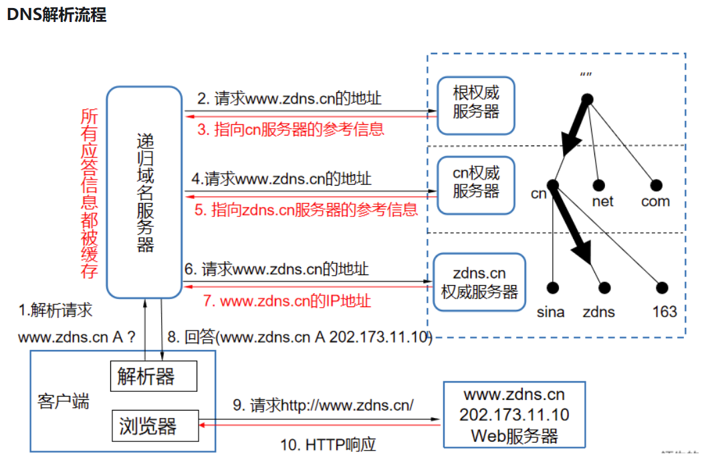
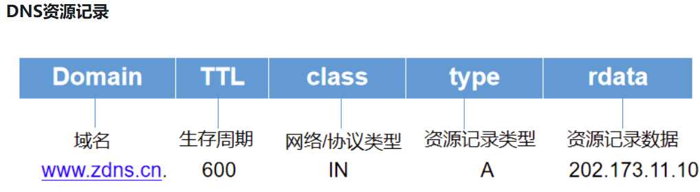
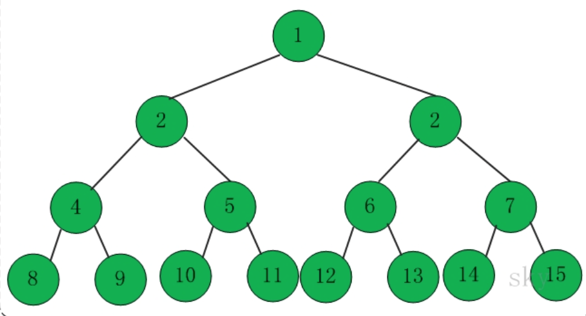
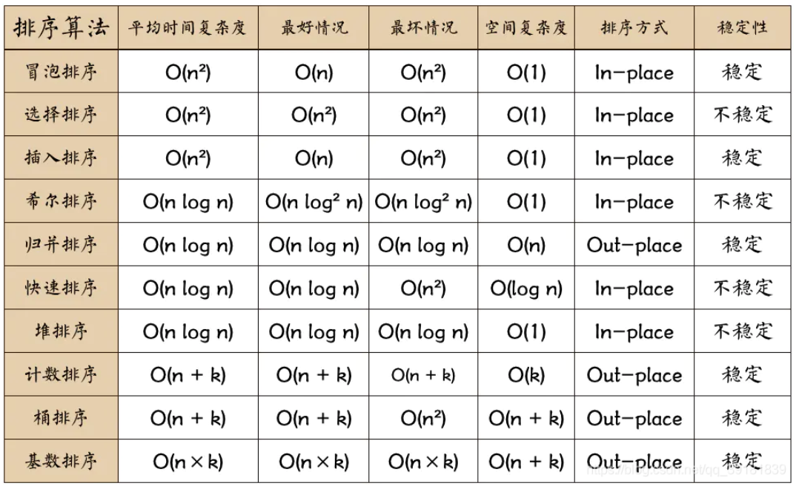
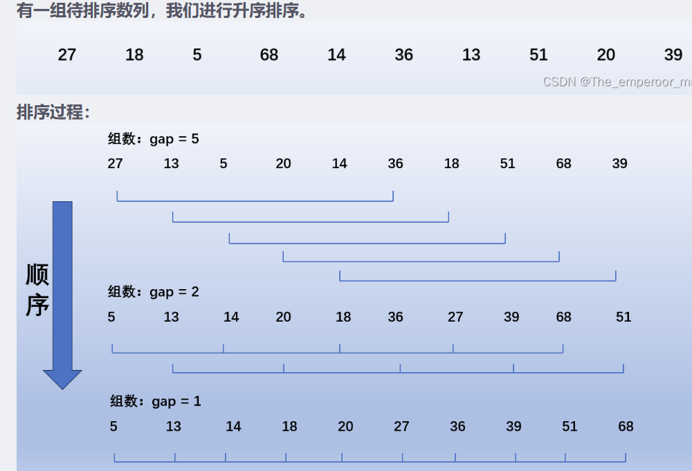
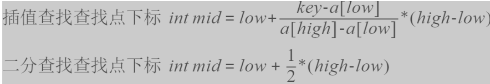
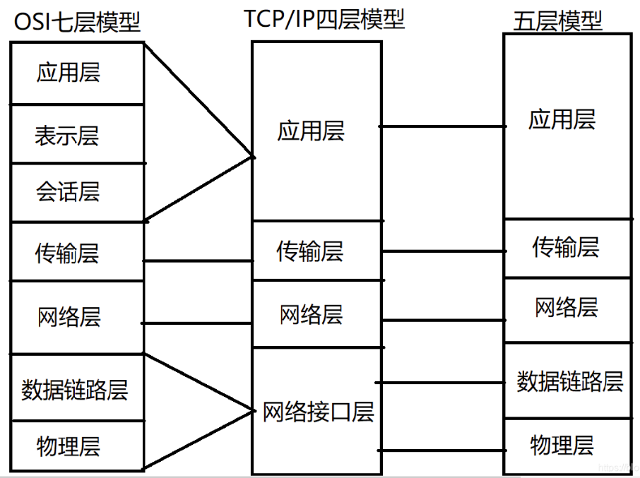

# 小橙编程学习宝典  
>
> ***XiaoCheng Programming Learning Book***
>

## 基础知识

### ✅ 互联网

### ⭐️ 域名

百度的IP地址 : 110.242.68.66(不好记)  
转换成域名：<https://www.baidu.com>

+ 协议：https
+ 二级域名：baidu.com
+ 顶级域名：com、cn、edu、org、net

### ⭐️ DNS

Domain Name System（域名系统）  
实现域名和IP地址相互映射的一个分布式数据库  
***域名解析***  ： 通过主机名得到对应IP地址



+ 递归域名服务器(本地缓存)  
+ 根权威服务器、顶级域权威、二级域权威

+ 记录一条域名信息映射关系，称之为资源记录（RR）  



+ 资源记录类型 type:
  + A : IPv4
  + AAAA : IPv6
  + PTR : Pointer指针
  + SRV : Service

### ⭐️ 服务器

> 提供互联网服务的计算机系统（如对外提供FTP、WEB服务）  

分类：

+ 基于结构：
  + 塔式服务器
  + 机架式
  + 刀片式
  + 机柜式
+ 基于应用
  + 文件
  + 数据库
  + 应用程序服务器；
+ 基于处理器个数
  + 单路（CPU个数）
  + 双路
  + 多路服务器
  
按指令集架构:

+ CISC ( 复杂指令集计算 ) ======== x86（Inter与AMD）
+ RISC ( 精简指令集计算 ) ======== ARM、Power
+ EPIC ( 显式并行指令计算 ) ======= Inter的安腾处理器

### ✅ 浏览器

#### 浏览器 DOM 事件流 / 事件委托

事件冒泡与捕获  
阻止事件传播：event.stopPropagation()

事件委托：（父元素监听子元素的冒泡事件）  
例：一个ul标签后有1000个li标签,要给每个li标签加一个点击事件,要求考虑页面性能。

```js
// four的事件冒泡到one，在one处理
// 通过event.target判断类名,分别绑定点击事件  
var x=event.target
```

#### ⭐️ 浏览器加载顺序

+ 主干流程

```js

1、从浏览器接收url到开启网络请求线程（涉及到：浏览器机制，线程和进程之间的关系等）  
2、开启网络线程到发出一个完整的http请求（涉及到：dns查询，tcp/ip请求，5层网络协议栈等）  
3、从服务器接收到请求到对应后台接收到请求（涉及到：均衡负载，安全拦截，后台内部的处理等）  
4、后台和前台的http交互（涉及到：http头，响应码，报文结构，cookie等，
   可以提下静态资源的cookie优化，以及编码解码如gzip压缩等）  
5、缓存问题：http缓存（涉及到：涉及到http缓存头部，etag，expired，cache-control等）  
6、浏览器接收到http数据包后的解析流程（涉及到：html的词法分析，然后解析成dom树，
   同时解析css生成css规则树，合并生成render树。
   然后layout布局、painting渲染、复合图层的合成、GPU绘制、外链接处理、loaded和documentloaded等）  
7、css可视化格式模型（涉及到：元素渲染规则，如：包含块，控制框，BFC，IFC等概念）  
8、js引擎解析过程（涉及到：js解释阶段，预处理阶段，执行阶段生成执行上下文，
   VO（全局对象），作用域链，回收机制等）  
9、其他（扩展其他模块：跨域，web安全等）
```

#### ⭐️ 浏览器渲染过程

+ DOM树渲染
+ 事件循环EventLoop  （主线程执行完去执行等待队列中的task）
+ CSS处理完生成CSSOM
+ 与DOM结合生成Render Tree(渲染树)
+ 回流（Layout）====> 计算需要渲染的确切位置和大小
+ 重绘（Painting）====> 画多少像素，画什么颜色
+ Display(GPU展示)

前端性能优化  

+ 减少http请求次数和大小
  + ①资源合并压缩
  + ②图片懒加载
  + ③音视频走流文件等

#### 浏览器事件循环

```js
1.调用栈（Call Stack）
   首先，浏览器维护一个称为调用栈的数据结构。调用栈用于跟踪执行中的 JavaScript 代码。
每当函数被调用，它的调用帧（function frame）会被推入调用栈，并在函数执行完毕后弹出。

2.消息队列（Message Queue）
   浏览器还维护一个消息队列，用于存储待处理的事件和消息。这些事件可以包括用户交互事件、网络请求完成、
   定时器到期、异步回调等。消息队列遵循先进先出（FIFO）原则。

3.事件循环
   浏览器事件循环是一个持续运行的循环，不断地检查调用栈和消息队列 。它的主要任务是将消息队列中的事件
一个一个地推送到调用栈中执行。当调用栈为空时，事件循环会检查消息队列。
   如果消息队列中有等待的事件，事件循环会将第一个事件推送到调用栈中执行。
事件处理完成后，调用栈再次为空，事件循环继续检查消息队列，重复这个过程。
4.微任务队列
   除了消息队列外，浏览器还维护一个微任务队列（Microtask Queue）。微任务是在主线程空闲时执行的任务，
通常与 Promise、async/await、MutationObserver 等相关。微任务队列的任务会在消息队列中的事件之前执行。

5.宏任务与微任务
   宏任务（Macro Task）通常包括消息队列中的事件，例如定时器、网络请求、UI 渲染等
   宏任务的优先级低于微任务。
   微任务（Micro Task）是在主线程空闲时执行的任务，优先级较高。
常见的微任务包括 Promise 的 then 和 catch 方法、async/await 中的 await、MutationObserver 回调等。
```

#### 浏览器同源策略
>
> 同源策略就是指必须在同一个协议，域名，端口号下，而且三者必须一致的
>

<http://www.child.a.com/test/index.html> ----失败，域名不同  
<https://www.a.com/test/index.html> ----失败，协议不同  
<http://www.a.com:8080/test/index.html> ----失败，端口号不同  

不受同源策略限制的资源

+ 页面上的链接，比如 a 链接。
+ 重定向。
+ 表单提交。
+ 跨域资源的引入，比如：script, img, link, iframe。

#### 浏览器跨域

> 不同源的脚本数据交互

解决方案：

+ JSONP 解决跨域 (<http://a.com/jsonp.html> 想要获取 <http://b.com/main.js> 的数据)
  
```js
在 http://a.com/jsonp.html 创建一个 script 脚本，
http://b.com/main.js?callback=xxx。
在main.js中调用这个回调函数xxx，并且以JSON数据形式作为参数传递，完成回调。

// 缺点
只能使用 GET 请求方式，无法使用 POST 请求方式。
可能被注入恶意代码，篡改页面内容
```

+ CORS 解决跨域 ( W3C标准，"跨域资源共享" )

> 它允许浏览器向跨源服务器，发出XMLHttpRequest请求，从而克服了AJAX只能同源使用的限制。

```js
// 在http://b.com里面添加响应头声明允许http://a.com的访问
Access-Control-Allow-Origin: http://a.com
```

#### 浏览器缓存

> 由请求头的expires和cache-control判断====>命中强缓存策略? 从缓存获取资源 : No ====> 下一步  
> 由请求头的last-modified和etag判断======>命中协商缓存? 从缓存获取：No ====> 下一步  
直接从服务端获取资源

+ 强缓存策略  
   不会向服务器发送请求，直接从缓存中读取资源  
   ache-Control优先级比Expires高
  + Expires ：缓存过期时间
  + ache-Control ： 用于控制网页缓存
  
      1. public ： 所有内容都将被缓存（客户端和代理服务器都可缓存）
      2. private ： 所有内容只有客户端可以缓存(默认)
      3. no-cache ： 客户端缓存内容，但是是否使用缓存则需要经过协商缓存来验证决定
      4. no-store ： 所有内容都不会被缓存，即不使用强制缓存，也不使用协商缓存
      5. max-age= numeric ：缓存内容将在xxx秒后失效

+ 协商缓存  
   强制缓存失效后，浏览器携带缓存标识向服务器发起请求，由服务器根据缓存标识决定是否使用缓存的过程
  + ⭐协商缓存生效，返回304和Not Modified
  + ⭐协商缓存失效，返回200和请求结果

#### 控制台调试技巧
  
### ✅ HTTP

1. ❗ HTTP 请求过程  
   DNS解析===>建立TCP连接===>发送HTTP请求===>服务器响应,得到HTML代码  
   ===>解析HTML代码,请求HTML代码中的资源===>关闭TCP连接，并渲染
2. 常见 HTTP 协议
   + HTTP 1.0  
      无状态、无连接的应用层协议  
      队头阻塞（响应到了才可以发下一个请求）  
      缓存（主要使用协商缓存，强制缓存Expires做缓存判断的标准）
   + ⭐️ HTTP 1.1
      特点：简单,灵活,易扩展,应用广泛,跨平台  
      缺点 ： 无状态,明文传输,不安全  
      长连接 :  不提出断开连接就保持连接状态  
      管道传输 ： 可以发出多个请求  
   + HTTP 2
      头部压缩：用HPAK算法去重  
      二进制格式  
      多路复用 ：真正的并行传输,任意数量的HTTP请求  
      服务端推送：主动向客户端推送额外资源  
         TCP导致队头阻塞
   + HTTP 3
      无队头阻塞  
      连接建立
      连接迁移

3. ⭐️ HTTP 请求类别

   GET、POST、PUT、DELETE、HEAD、CONNECT、OPTIONS、TRACE  
4. WebSocket（即时通讯）  
   一种双向通信协议，类似于长连接
5. ⭐️ Cookie
   小型文本文件，本地存储用户信息以识别身份
6. Session  
   会话控制，用于存储信息（类似于Map的Kv键值对）  

   ```js
   区别：
   (1)cookie数据存放在客户的浏览器上，session数据放在服务器上
   (2)cookie不是很安全，别人可以分析存放在本地的COOKIE并进行COOKIE欺骗,如果主要考虑到安全应当使用session
   (3)session会在一定时间内保存在服务器上。当访问增多，会比较占用你服务器的性能，如果主要考虑到减轻服务器性能方面，应当使用cookie
   (4)单个cookie在客户端的限制是3K
   (5)将登陆信息等重要信息存放为Session;其他信息如果需要保留，可以放在cookie中
   ```

7. ⭐️ HTTPS ( 超文本传输安全协议 )
   + HTTP 明文传输，数据都是未加密的，安全性较差，HTTPS（SSL+HTTP） 数据传输过程是加密的，安全性较好。
   + 使用 HTTPS 协议需要到 CA（Certificate Authority，数字证书认证机构） 申请证书，一般免费证书较少，因而需要一定费用。
   + HTTP 页面响应速度比 HTTPS 快，主要是因为 HTTP 使用 TCP 三次握手建立连接，客户端和服务器需要交换 3 个包，而 HTTPS除了 TCP 的三个包，还要加上 ssl 握手需要的 9 个包，所以一共是 12 个包。
   + http 和 https 使用的是完全不同的连接方式，用的端口也不一样，前者是 80，后者是 443。
   + HTTPS 其实就是建构在 SSL/TLS 之上的 HTTP 协议，所以，要比较 HTTPS 比 HTTP 要更耗费服务器资源。
  
---

## 计算机基础

✅ 算法和数据结构  
⭐️ 时间 / 空间复杂度分析  

+ 时间复杂度：评估执行程序所需时间。估算***处理器*** 的使用程度。 ==== 公式： T(n) = O(f(n))
  + 常数阶O(1) ==========> 各行执行1次
  + 对数阶O(logN) ========> 循环中i = i * 2
  + 线性阶O(n) ==========> 普通for循环
  + 线性对数阶O(nlogN) ====> for循环中的 i = i * 2
  + 平方阶O(n²) ==========> 两层嵌套for循环
  + 立方阶O(n³) ==========> 三层嵌套for循环
  + 指数阶(2^n) =========> 求N个元素的子集、汉诺塔等
  + 阶乘阶 O(n!) =========> 外层循环n次，内层n-1次
  
+ 空间复杂度：评估执行程序所需存储空间。估算***内存*** 的使用程度。  ==== 公式： S(n) = O(f(n))
  + O(1) ========> 分配的空间不随处理数据量变化
  + O(n) ========> int[] m = new int[n]
  + O(n) ========> 两层for循环内的 new int[n]
  + O(logN) ======> 递归算法、二分查找法

### 数据结构

数据结构三要素：逻辑结构、存储结构、数据的运算

+ 逻辑结构：线性（线性表、栈、队列）和非线性（树、图、集合）
+ 存储结构：顺序存储、链式存储、索引存储和散列存储

数据类型包括：原子类型、结构类型、抽象数据类型

#### 数组与字符串

通过**索引**将相同类型的若干变量有序组织在一起的集合  
操作：**读取**:T(n)=O(1) 、 **查找**:O(N) 、 **插入**:末尾/中间(链表更佳)、**删除**:O(N)===> 1+(n-1)=n

#### 队列  

特殊的线性表，仅允许在表的一端进行插入操作，另一端删除

#### 栈  

特殊的线性表，只能在表的一个固定端点进行数据节点的插入和删除

#### 链表  

按照链式存储，在物理上非连续

#### 集合  

由一个或多个确定的元素构成的整体，元素类型不一定相同，没有顺序

#### 哈希表(散列表)  

无论数据量多少，T(n)=O(1)  
基于数组和哈希函数，被填满后性能下降严重  
HashMap中的hasCode方法转换(同一个Key生成的哈希值相同)  

+ 哈希冲突(解决)
  + 开放地址法：①线性探测、②二次探测(平方)、③双哈希法(第二次hash生成探测步长)
  + 链表法： 每个数组对应一条链表，往后追加

#### 二叉树  

每个节点最多两个子树，可为空集(左右节点)

+ 性质1：二叉树第i层上的节点数目最多为 2^{i-1} (i≥1)
+ 性质2：深度为k的二叉树至多有2^k-1个节点（k>=1）
+ 性质3：包含n个节点的二叉树的高度至少为log2 (n+1)
+ 性质4：在任意一颗二叉树中，若终端节点的个数为n0,度为2的节点数为n2，则n0=n2+1  



分类：

+ 满二叉树
+ 完全二叉树 （最下层节点可小于2，节点全靠左）
+ 二叉搜索树 （左小右大）
+ ⭐平衡二叉搜索树(AVL) ：（左右子树高度差绝对值不超过1）

链式存储(左右指针)、顺序存储(数组存储)  
**深度优先**：前序遍历、中序遍历、后序遍历  
**广度优先**：层次遍历(迭代法)  

### 算法  

#### 排序



+ ①冒泡排序  
   比较相邻的元素，交换，重复多轮  
+ ②快速排序  
   指定一个base(一般为第一个数)，定义左右指针(l,r)，右指针r->左寻比base小的数并与l交换，  
   再左指针l->右寻大于base的数并与r交换，直至l与r指向同一个数，再替换为base，第一轮结束
+ ③插入排序  
   构建有序序列，对于未排序序列，在已排序中从后向前扫描，在合适位置插入
+ ④希尔排序(缩小增量法)  
   分组思想，取gap=5值分5组，在每组中进行直接插入排序，并每次减小gap值。  

   
+ ⑤选择排序  
   在未排序中找最小，放到起始位置，再在剩余未排序中找最小拍到已排序的末尾
+ ⑥堆排序
   堆(近似完全二叉树)  
   》子节点的键值总小于或大于父节点  
   》大根堆：升序 ======= 小根堆：降序  
   基本思想:
   > 将待排序的数组构造大根堆，顶端即为最大值  
   > 与末尾的数交换  
   > 再将剩余的n-1个数再构造成大根堆，并与末尾的交换。

+ ⑦归并排序  
   将未排序序列从中间分为2部分，再分为4部分，直至为一个一个的数据，再两两归并，并排序

+ ⑧计数排序  
   先找到无序数组的最大值与最小值，并申请额外空间（max-min+1）  
   按照无序数组的数值与额外空间的下标一致，每次+1

+ ⑨桶排序(计数排序pro)  
   确定数组元素分布范围，分出n个桶，区间依次为[0-9]、[10-19]等  
   将元素放入桶中并进行排序，最后依次输出

+ ⑩基数排序  
   准备10个桶(0-9)，按照数组中元素 个位 的值，入桶并排序

#### 双指针  

   相同方向(快慢指针)=====相反方向(对撞指针)  
   ⭐遇到有序数组就用双指针，两个指针同时遍历会减少空间、时间复杂度

#### 查找  

+ 顺序查找
+ 二分查找
  > 确定范围low=0, high=N-1, mid=(low+high) / 2  
  > 若mid == x 或者 low >= high 就结束  
  > 若mid < x,令low = mid+1  ,获取mid新, 再执行上一步  
  > 若mid > x,令low = mid-1  ,获取mid新, 再执行上上步
+ 插值查找(类似于二分查找)
  
+ 树结构查找
  > 二叉树查找
+ 散列表查找(哈希)  
  > 哈希函数使每个元素的关键字都与一个函数值（即数组下标）相对应

#### 递归(套娃)  

#### 回溯(递归的副产品)  

从一条路往前走，能进则进，不能进则退回来，换一条路再试，从而搜索到抵达特定终点的一条或者多条特定路径。

#### 贪心  

选取局部最优解

#### 位运算  

操作二进制数
常见 :  与(&)、或(|)、异或(^)、取反(~)  
 : 左移(<<)、右移(>>是带符号右移 >>>无符号右移动)

#### DFS深度优先搜索  

沿树的深度走到底，回溯
⭐时间换空间
栈(先进后出)

#### BFS广度优先搜索  

沿着树的宽度遍历
⭐空间换时间  
队列(先进先出)

#### 图  

分类:

+ 连通图与非连通图
+ 加权图与未加权图
+ 有向图与无向图
+ 循环图与非循环图

图算法：

+ 路径搜索
  + DFS & BFS
  + 最短路径(Dijkstra算法和Floyd算法)
  + 最小生成树  
​  最小生成树能够保证整个拓扑图的所有路径之和最小，但不能保证任意两点之间是最短路径。最短路径是从一点出发，到达目的地的路径最小。
  + ⭐随机游走
+ 中心性计算  
   鉴定一群人中最有影响力的一些人

+ 社群发现

#### 分治  

分治思想，分而治之  
用于二分搜索、合并排序、快速排序、汉诺塔

#### 动态规划DP  

拆分子问题，记住过往，减少重复计算。  
1+1+1+1=4  左边加一个1+ 变成5  
记住求过的解来节省时间
<=>经典问题：青蛙跳台阶  

```js
f（10） = f（9）+f(8)
f (9)  = f(8) + f(7)
f (8)  = f(7) + f(6)
...
f(3) = f(2) + f(1)

// 即通用公式为: f(n) = f(n-1) + f(n-2)
```

递归耗时，存在大量重复计算，使用动态规划(带备忘录)  
一般使用一个数组或者一个哈希map充当这个备忘录

```Java
//先判断有没计算过，即看看备忘录有没有
if (tempMap.containsKey(n)) {
    //备忘录有，即计算过，直接返回
    return tempMap.get(n);
} else {
    // 备忘录没有，没有计算过，执行递归计算,并把结果保存到备忘录map中，对1000000007取余（题目规定）
    tempMap.put(n, (numWays(n - 1) + numWays(n - 2)) % 1000000007);
    return tempMap.get(n);
}
```

---

## ✅ 计算机网络

### HTTP 协议

超文本传输协议，基于TCP层协议的应用层传输协议  

+ 支持客户/服务器模式
+ 简单快速 ： 只需传送请求方法和路径
+ 灵活 ： 任意数据对象
+ 无连接 ： 每次都只处理一个请求
+ 无状态 ： 对事务处理没有记忆能力，后续处理需要前面的信息，要重传

### 网络模型



### UDP / TCP 协议

```txt
1. <连接>         TCP 是面向连接的传输层协议，传输数据前先要建立连接。UDP 是不需要连接，即刻传输数据。
2. <服务对象>     TCP 是一对一的两点服务。UDP 支持一对一、一对多、多对多的交互通信
3. <可靠性>       TCP 是可靠交付数据的，数据可以无差错、不丢失、不重复、按需到达。
                  UDP 是尽最大努力交付，不保证可靠交付数据。
4. <拥塞、流量控制>   TCP 有拥塞控制和流量控制机制，保证数据传输的安全性。
                     UDP 则没有，即使网络非常拥堵了，也不会影响 UDP 的发送速率。
```

---

## ✅ 操作系统

### 进程、线程

```txt
1.地址空间：
线程共享本进程的地址空间，而进程之间是独立的地址空间。

2.资源：
线程共享本进程的资源如内存、I/O、cpu等，不利于资源的管理和保护，
而进程之间的资源是独立的，能很好的进行资源管理和保护。

3.健壮性：
多进程要比多线程健壮，一个进程崩溃后，在保护模式下不会对其他进程产生影响，
但是一个线程崩溃整个进程都死掉。

4.执行过程：
每个独立的进程有一个程序运行的入口、顺序执行序列和程序入口，执行开销大。
但是线程不能独立执行，必须依存在应用程序中，由应用程序提供多个线程执行控制，执行开销小。

5.可并发性：
两者均可并发执行。

6.切换时：
进程切换时，消耗的资源大，效率不高。所以涉及到频繁的切换时，使用线程要好于进程。
同样如果要求同时进行并且又要共享某些变量的并发操作，只能用线程不能用进程。
```

### 进程 / 线程间通讯方式

进程间通信:

```txt
1.管道(Pipe) ==== 半双工
2.有名管道(NamedPipe) 允许无亲缘关系进程间的通信
3.信号量(一个计数器，作为锁机制，防止防止进程访问共享资源时，其他进程也访问)
4.消息队列(克服了信号传递信息少、管道只有无格式字节流以及缓冲区大小受限等)
5.信号
6.共享内存
7.套接字(不同设备)
```

线程间通信 :   主要是用于线程同步

```txt
1.锁机制 : 包括互斥锁、条件变量、读写锁
2.信号量机制 : 包括无名和命名 线程信号量
3.信号机制 : 类似进程间
```

### 进程调度算法

+ 先来先服务(FCFS)
+ 多作业优先
+ 优先级
+ 高响应比优先
+ 时间片轮转

### 进程 / 线程状态

```txt
二、进程状态（5 种）

1.创建状态(new) ：进程正在被创建，尚未到就绪状态。
2.就绪状态(ready) ：进程已处于准备运行状态，即进程获得了除了处理器之外的一切所需资源
                  一旦得到处理器资源(处理器分配的时间片)即可运行。
3.运行状态(running) ：进程正在处理器上上运行
4.阻塞状态(waiting) ：又称等待状态，进程等待某一事件而暂停运行
                     如等待某资源为可用或等待 IO 操作完成。处理器空闲也不能运行
5.结束状态(terminated) 

三、线程状态（6种）

1.初识状态（new）：     新创建了一个线程对象，但还没有调用start()方法时。
2.运行状态（runnable）：线程调度程序从可运行池中选择一个线程获得CPU时间片后，
                      被选中线程进入的状态。线程进入运行状态的唯一方式。
3.阻塞状态（blocked）：阻塞状态是线程阻塞在进入synchronized关键字修饰的方法
                      或代码块(获取锁)时的状态。
4.等待状态（waiting）： 处于这种状态的线程不会被分配CPU执行时间，它们要等待被
                      显式地唤醒，否则会处于无限期等待的状态。
5.超时等待状态（timed_waiting）：线程不会被分配CPU执行时间，达到一定时间后自动唤醒。
6.终止状态（terminated）：线程的run()方法完成时，或主线程的main()方法完成时，就终止
```

### 死锁

1. 产生的原因 ：①竞争资源 、 ②进程间推进顺序非法  
2. 产生的4个必要条件 ：

   + 互斥条件
   + 请求和保持条件
   + 不剥夺条件
   + 环路等待条件  

3. 解决办法：

   + 预防死锁(破坏4个条件)
   + 避免死锁：银行家算法
   + 检测死锁  
     + 为每个进程和每个资源指定一个唯一的号码
     + 建立资源分配表和进程等待表
   + 解除死锁（剥夺资源和撤销进程）

### 内存管理

1. 什么是虚拟内存？解决了什么问题？  
   独立的虚拟地址空间(以为是独享的)  
   方便内存访问，使有限的物理内存运行一个比它大很多的程序

2. 说说分页和分段的机制？  
   分页是实现虚拟内存的技术

3. 页表的作用？为什么引入多级页表？

4. 页面置换算法有哪几种？

   + OPT页面置换算法（最佳页面置换算法）
   + FIFO页面置换算法（先进先出页面置换算法）
   + LRU页面置换算法（最近未使用页面置换算法）
   + LFU页面置换算法（最少使用页面排序算法）

5. 内存是如何分配的？

6. 内存是如何回收的？

---

## 软件开发基础

✅ 设计模式

### 单例模式

一个类只有一个实例，并提供一个访问它的全局访问点。

### 代理模式

一个类代表另一个类的功能，向外界提供功能接口

### 工厂模式

创建对象时提供了一种封装机制，实际创建对象的代码与使用代码分离

### 装饰器模式

向一个现有的对象添加新的功能，同时又不改变其结构

### 观察者模式

定义了一种一对多的依赖关系，当一个对象的状态发生改变时，其所有依赖者都会收到通知并自动更新

### 策略模式

一个类的行为或其算法可以在运行时更改

### 门面模式  

外部与一个子系统的通信必须通过一个统一的门面对象进行
