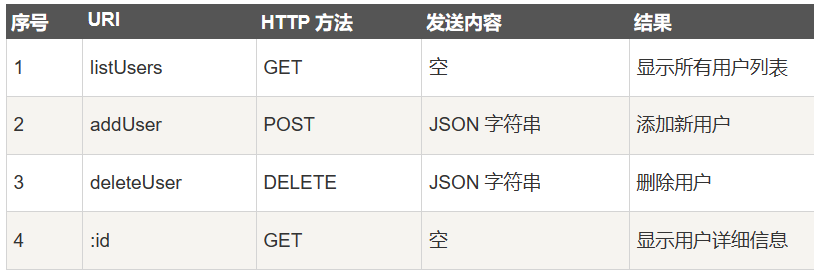
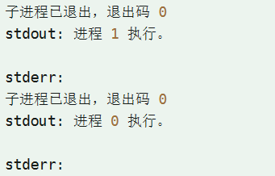
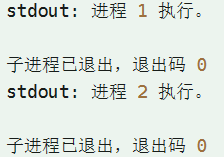
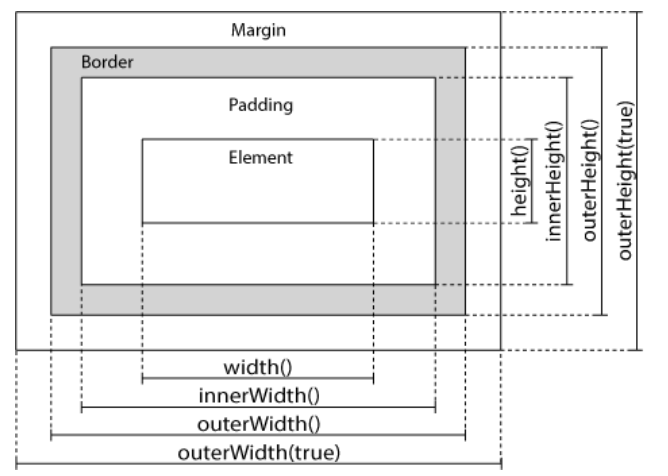
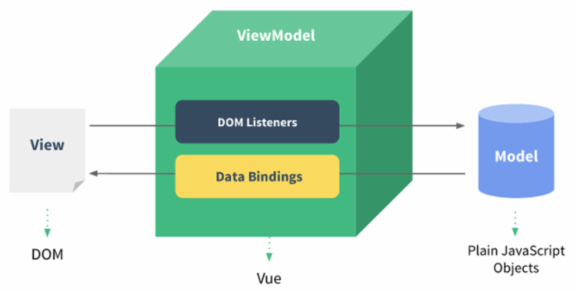

# 小橙编程学习宝典  
>
> ***XiaoCheng Programming Learning Book***
>

## 工具

### ✅***Node.js***  

一个开源与跨平台的 JavaScript 运行时环境

- 运行在服务端的JS
- 几乎每一个 API 都支持回调函数
- 事件机制都用观察者模式实现
- 使用事件驱动模型

#### 1. 创建 Node.js 应用

  1. 使用 ***require*** =======  指令加入模块(require("os模块/http模块");)
  2. 创建服务器

        ```Js
        var http = require('http');
        http.createServer(function (request, response) {
            // 发送 HTTP 头部 
            // HTTP 状态值: 200 : OK
            // 内容类型: text/plain
            response.writeHead(200, {'Content-Type':'textplain'});
            // 发送响应数据 "Hello World"
            response.end('Hello World\n');
        }).listen(8888);
        // 终端打印如下信息
        console.log('Server running at http://127.0.01:8888/');
        ```

  3. 包管理工具NPM

        ```Js
        npm install express          # 本地安装
        npm install express -g       # 全局安装
        npm uninstall express        
        npm ls                       
        npm update express
        npm search express
        npm publish
        ```

#### 2. 核心

  1. 回调函数
    一般作为函数的最后一个参数出现：
        > function foo1(name, age, callback) { }

        ```Js
        var fs = require("fs");

        fs.readFile('input.txt', function (err, data) {
            if (err) return console.error(err);
            console.log(data.toString());
        });

        console.log("程序执行结束!");
        ```

      主线程一直执行 打印“程序执行结束” ， 后异常调用函数报错

  2. 事件循环EventLoop和EventEmitter对象

      ```Js
      // 引入 events 模块
      var events = require('events');
      // 创建 eventEmitter 对象
      var eventEmitter = new events.EventEmitter();
      
      // 绑定事件及事件的处理程序
      eventEmitter.on('eventName', eventHandler);

      // 触发事件
      eventEmitter.emit('eventName');
      ```

      EventEmitter核心即： 事件触发与事件监听器功能的封装

  3. Buffer（缓冲区）========= 存放二进制数据

      ```Js
      // 1. Buffer 与 字符编码
      const buf = Buffer.from('runoob', 'ascii');
      // 输出 72756e6f6f62
      console.log(buf.toString('hex'));
      // 输出 cnVub29i
      console.log(buf.toString('base64')); // 编码格式

      // 2. 除 .from 方法外 创建Buffer类的方法
      // ①创建一个长度为 10、且用 0 填充的 Buffer。
      const buf1 = Buffer.alloc(10);
      // ②创建一个长度为 10、且用 十进制 1 填充的 Buffer。 
      const buf2 = Buffer.alloc(10, 1);
      // ③返回的 Buffer 实例可能包含旧数据，要重写
      const buf3 = Buffer.allocUnsafe(10);

      // 3. 写入缓冲区
      buf.write("String","编码");
      // 4. 读取
      buf.toString("编码",start,end);
      // 5. 转换成Json对象
      buf.toJSON();
      // 6. 缓冲区合并
      Buffer.concat([buffer1,buffer2]);
      // 7. 比较
      var result = buffer1.compare(buffer2); 
      // 8. 拷贝
      buf2.copy(buf1, 2);
      // 9. 裁剪
      buffer1.slice(0,2);
      ```
  
  4. Stream流
      一个抽象接口，有4种流类型：Readable | Writable | Duplex | Transform  
      所有Stream对象都是EventEmitter实例，可触发事件：data | end | error | finish  

      ```Js
      // 创建读写流
      var readerStream = fs.createReadStream('input.txt');
      var writerStream = fs.createWriteStream('output.txt');
      // 设置编码格式
      readerStream.setEncoding('UTF8');
      writerStream.write(data,'UTF8');
      // 处理流事件
      readerStream.on('data', function(chunk){}；
      writerStream.on('finish', function() {
            console.log("写入完成。");
      });

      // 管道流：实现复制 
      readerStream.pipe(writerStream);
      // 链式流  连接输出流到另外一个流
      // 配合管道流压缩 input.txt 文件为 input.txt.gz
      fs.createReadStream('input.txt')
      .pipe(zlib.createGzip())
      .pipe(fs.createWriteStream('input.txt.gz'));
      
      // 配合管道流解压 input.txt.gz 文件为 input.txt
      fs.createReadStream('input.txt.gz')
      .pipe(zlib.createGunzip())
      .pipe(fs.createWriteStream('input.txt'));
      ```

  5. 模块系统  
      &emsp;&emsp;提供了 exports 和 require 两个对象， exports 是模块公开的接口，require 用于从外部获取一个模块的接口，即所获取模块的 exports 对象。

      ```Js
      // exports是一个接口，引入该文件的对象都能调用.world方法
      exports.world = function() {
            console.log('Hello World');
      }

      // 调用  获得的hello就是exports对象
      var hello = require('./hello');
      hello.world();
      ```

      将对象封装到模块中

      ```Js

      function Hello() { 
         var name; 
         this.setName = function(thyName) { 
               name = thyName; 
         };  
      }; 
      // 又封装一层
      module.exports = Hello;

      // 直接获得这个对象 || 先获得封装后的模块名Hello，再获得对象hello
      var Hello = require('./hello'); 
      hello = new Hello(); 
      hello.setName('BYVoid');

      // ⭐️相当于使用模块 
      var hello = require("Hello");
      ```

      Node.js中存在4类模块(原生模块和3中文件模块，原生优先)  
      但更优先加载缓存中已存在的模块

  6. 函数
      Js中一个函数可以作为另一个函数的参数  
      达到一个函数可以使用另一个函数的效果

      ```Js
      function say(word) {
         console.log(word);
      }

      function execute(someFunction, value) {
         someFunction(value);
      }
      // 使用execute函数调用say函数，传递的是say本身而非返回值
      execute(say, "Hello");
      ```

  7. 路由
      指确定如何响应对特定端点（URL 路径）的 HTTP 请求的过程  

      **server.js文件**

      ```Js
      // 首先使用 url.parse 解析URL地址
      var pathname = url.parse(request.url).pathname;

      // 使用路由 对不同 url请求做出不同反应
      ⭐route(pathname)

      // 再使用response做出响应
      response.writeHead(200, {"Content-Type": "text/plain"});
      response.write("Hello World");
      response.end();
      ```

      **router.js文件**

      ```Js
      function route(pathname) {
          console.log("About to route a request for " + pathname);
      }
      
      ⭐exports.route = route;
      ```

      **index.js文件** 使得路由函数被注入到服务器中

      ```Js
      var server = require("./server");
      var router = require("./router");
      
      // 调用 server的start函数并使用route函数
      ⭐server.start(router.route);
      ```

  8. 全局对象
      特殊对象，在任何地方都可以访问，Js中是window对象，Node.js中全局对象是global,所有全局变量都是global对象的属性  
      >__filename ============== 正在执行的文件名  
      >__dirname ============== 当前执行脚本所在目录  
      ⭐ console 提供控制台标准输入输出  
      > console.dir() ============= 检查对象  
      > console.trance() =========== 输出当前调用栈(在栈堆中的调用路径)  
      > console.assert() =========== 判断表达式是否为真  
      ⭐ process 描述当前进程状态的对象，可操作系统  
      > exit =================== 进程准备退出时触发  
      > beforeExit node ======= 清空事件循环时node退出，但其监听器可异步调用，node会继续执行  
      > uncaughtException =========== 一个异常冒泡回到事件循环，触发  
      > Signal ================= 进程接收到信号，触发

      ```Js
      // 输出到终端
      process.stdout.write("Hello World!" + "\n");
      // 通过参数读取
      process.argv.forEach(function(val, index, array) {
      console.log(index + ': ' + val);});
      // 获取执行路径
      console.log(process.execPath);
      // 平台信息
      console.log(process.platform);
      ```

#### 3. 扩展

1. 常用工具util  

   - util.callbackify 将 async 异步函数转换成遵循异常优先的回调风格
   - util.inherits 实现对象间原型继承
   - util.inspect 将任意对象转换为字符串
   - util.isArray(object) 判断object是否是数组
   - util.isRegExp(object) 判断是否是正则表达式

2. 文件系统fs

   - fs.readFile 异步读取
   - fs.readFileSync 同步读取
   - fs.open(path, r/w/a, 权限)
   - fs.status(path, callback) 获取文件信息
     - status.isFile()
     - status.isDirectory()
   - fs.ftruncated(fd, len) 截取文件
   - fs.unlink(path) 删除文件

3. GET/POST 请求  
      - 手动解析url作为GET请求的参数  
      &emsp;&emsp;var params = url.parse(res.url, true).query;  
      - 获取POST请求内容：  
      &emsp;&emsp;POST请求的内容都在请求体中，ServerRequest 并没有一个属性内容为请求体

      ```Js
      // 定义了一个post变量，用于暂存请求体的信息
      var post = '';     
      
      // 通过req的data事件监听函数，每当接受到请求体的数据，就累加到post变量中
      req.on('data', function(chunk){    
            post += chunk;
      });
      
      // 在end事件触发后，通过querystring.parse将post解析为真正的POST请求格式，然后向客户端返回。
      req.on('end', function(){    
            post = querystring.parse(post);
            res.end(util.inspect(post));
      });
      ```

4. 工具模块

   - OS ================ 提供基本的系统操作函数
   - Path模块 ============ 提供了处理和转换文件路径的工具。
   - Net 模块 ============ 用于底层的网络通信。提供了服务端和客户端的的操作。
   - DNS 模块 =========== 用于解析域名。
   - Domain 模块 ========= 简化异步代码的异常处理，可以捕捉处理try catch无法捕捉的。  

5. Express框架（Web应用框架）

      ```Js
      // 客户端发起请求，响应 “HW” 字符串
      var express = require('express');
      var app = express();
      
      app.get('/', function (req, res) {
      res.send('Hello World');
      })
      
      var server = app.listen(8081, function () {
      
      var host = server.address().address
      var port = server.address().port
      
      console.log("应用实例，访问地址为 http://%s:%s", host, port)})
      ```

      ⭐**路由**  
      决定了谁去响应客户端请求  
      提供路由 提取URL和GET/POST参数  

      ```Js
      var express = require('express');
      var app = express();
      
      //  主页输出 "Hello World"
      app.⭐get('/', function (req, res) {
      console.log("主页 GET 请求");
      res.send('Hello GET');
      })
      
      
      //  POST 请求
      app.⭐post('/', function (req, res) {
      console.log("主页 POST 请求");
      res.send('Hello POST');
      })
      
      //  /del_user 页面响应
      app.get('/del_user', function (req, res) {
      console.log("/del_user 响应 DELETE 请求");
      res.send('删除页面');
      })
      
      var server = app.listen(8081, function () {
      
      var host = server.address().address
      var port = server.address().port
      
      console.log("应用实例，访问地址为 http://%s:%s", host, port)
      
      })
      ```

      **静态文件**  
      提供了内置的中间件 express.static 来设置静态文件  
      > app.use('/public', express.static('public'));

      可以访问<http://127.0.0.1:8081/public/images/logo.png>获取静态资源

      ⭐GET方法/POST方法/Cookie获取

6. RESTful API  
      即表述性状态传递（Representational State Transfe）  
      

      ```Js
      // 获取用户列表
      app.get('/listUsers', function (req, res) {
      fs.readFile( __dirname + "/" + "users.json", 'utf8', function (err, data) {
            console.log( data );
            res.end( data );});})

      // 添加用户 
      app.post('/addUser', function (req, res) {
      // 读取已存在的数据
      fs.readFile( __dirname + "/" + "users.json", 'utf8', function (err, data) {
            data = JSON.parse( data );
            data["user4"] = user["user4"];
            console.log( data );
            res.end( JSON.stringify(data));});})

      // 显示用户详情 id
      app.get('/:id', function (req, res) {
      // 首先我们读取已存在的用户
      fs.readFile( __dirname + "/" + "users.json", 'utf8', function (err, data) {
            data = JSON.parse( data );
            var user = data["user" + req.params.id] 
            console.log( user );
            res.end( JSON.stringify(user));});})

      // 删除用户 
      app.delete('/deleteUser', function (req, res) {
      fs.readFile( __dirname + "/" + "users.json", 'utf8', function (err, data) {
            data = JSON.parse( data );
            delete data["user" + id];
            
            console.log( data );
            res.end( JSON.stringify(data));});})
      ```

7. 多进程  
      &emsp;&emsp;虽然Node.js是单线程运行，但使用的是 **事件驱动** 来处理并发，可以在多核CPU的系统上创建多个子进程，从而提高性能  
      &emsp;&emsp;每个子进程带3个流对象：child.stdin | child.sstdout | child.stderr, 可共享父进程的stdio流，也可是独立的被导流的对象  

      **创建子进程：child_process模块**  

      - **exec方法**  
      &emsp;&emsp;使用子进程执行命令，缓存子进程的输出，并将子进程的输出以回调函数参数的形式返回。

      ```Js
      // support.js文件
      console.log("进程 " + process.argv[2] + " 执行。" );

      // master.js文件
      const fs = require('fs');
      const child_process = require('child_process');
      
      for(var i=0; i<3; i++) {
      // + i 是将 i 作为参数传回supports.js脚本
      var workerProcess = child_process.exec('node support.js '+i, function (error, stdout, stderr) {
            if (error) {
                  console.log(error.stack);
                  console.log('Error code: '+error.code);
                  console.log('Signal received: '+error.signal);
            }
            console.log('stdout: ' + stdout);
            console.log('stderr: ' + stderr);
      });
      workerProcess.on('exit', function (code) {
            console.log('子进程已退出，退出码 '+code);});}
      ```
      
      使用回调函数，结果是  
      

      - **spawn方法**  
      &emsp;&emsp;使用指定的命令行参数创建新进程。

      ```Js
      for(var i=0; i<3; i++) {
      // 创建新进程 
      var workerProcess = child_process.spawn('node', ['support.js', i]);
      
      workerProcess.stdout.on('data', function (data) {
            console.log('stdout: ' + data);
      });
      
      workerProcess.stderr.on('data', function (data) {
            console.log('stderr: ' + data);
      });
      ```

      没有回调函数，正常顺序执行，结果是  
      

      - **fork方法**  
      &emsp;&emsp; spawn()的特殊形式，用于在子进程中运行的模块，如 fork('./son.js') 相当于 spawn('node', ['./son.js']) 。与spawn方法不同的是，  
      ⭐**fork会在父进程与子进程之间，建立一个通信管道，用于进程之间的通信。**

      ```Js
      for(var i=0; i<3; i++) {
            // 不用前面加 node
      var worker_process = child_process.fork("suppor   js", [i]);    
      
      worker_process.on('close', function (code) {
            console.log('子进程已退出，退出码 ' + code);
      });}
      ```

8. 连接MySQL

```Js
// CRUD
var mysql      = require('mysql');
var connection = mysql.createConnection({
  host     : 'localhost',
  user     : 'root',
  password : '123456',
  database : 'test'
});

//查询数据
var  sql = 'SELECT * FROM websites';
connection.query(sql,function (err, result) {
      if(err){
          console.log('[SELECT ERROR] - ',err.message);
          return;}
      console.log(result);});
 
connection.end();
connection.connect();

// 插入数据
var  addSql = 'INSERT INTO websites(Id,name,url,alexa,country) VALUES(0,?,?,?,?)';
var  addSqlParams = ['菜鸟工具', 'https://c.runoob.com','23453', 'CN'];
connection.query(addSql,addSqlParams,function (err, result)
```

### ✅**JQuery**  

一个JavaScript库  
功能：

- HTML 元素选取、操作
- CSS 操作
- HTML 事件函数
- JavaScript 特效和动画
- HTML DOM 遍历和修改
- AJAX
- Utilities

#### 1. 语法

可以选取HTML元素并操作  
> **$(selector).action()**

文档就绪事件：  
&emsp;&emsp;JQuery函数都存在一个document ready函数  
&emsp;&emsp;防止在文档完全加载就绪 前 运行JQuery代码，DOM树加载完才可以操作。

否则失败：  

- 运行JQ函数 试图隐藏 还没加载出来的元素
- 获得未完全加载的图像的大小

✅事件

- click()
- dblclick()
- mouseenter() ⭐鼠标指针穿过元素
- mouseleave()
- mousedown()
- mouseup()
- hover() ⭐光标悬停
- focus() 获得焦点
- blur() 失焦

#### 2. 效果

1. 隐藏和显示  
   - **hide** (slow / fast / 毫秒 , "linear" / "swing")  
      第一个参数表示: 隐藏/显示的速度  
      第二个参数表示: 过度使用那种缓动函数
   - **show** ()  
   - **toggle** () 切换hide() 和 show() 方法
2. 淡入和淡出  

   - fadeIn("slow")
   - fadeOut()
   - fadeToggle()
   - fadeTo("slow", 0.15) ======= 渐变为给定的不透明度（介于0到1之间）

3. 滑动

   - slideDown("slow") 向下滑动元素
   - slideUp()
   - slideToggle()

4. 动画

      > **animate({params}, speed)**

      ```Js
      // 操作多个属性
      $("button").click(function(){
            $("div").animate({
                  left:'250px',     // 向左移动250px
                  opacity:'0.5',    // 透明度变为0.5
                  height:'150px',   // 高度宽度增加到150px
                  width:'150px'
            });
      });

      // 使用相对值
      height:'+=150px',       // 增高150px
      width:'+=150px'
      
      // 使用预定义的值
      height:'toggle'   // 隐藏和显示切换，还可以设置为 show、hide
      
      // 使用队列功能，多个animate()调用
      $("button").click(function(){
      var div=$("div");
      div.animate({height:'300px',opacity:'0.4'},"slow");
      div.animate({width:'300px',opacity:'0.8'},"slow");
      div.animate({height:'100px',opacity:'0.4'},"slow");
      div.animate({width:'100px',opacity:'0.8'},"slow");
      });
      ```

      **停止动画**  
      > **stop(stopAll, goToEnd)**  

      stopAll 规定是否清除动画队列  
      goToEnd 规定是否立即完成当前动画

5. CallBack方法
      回调函数在 动画、效果完成后 再实现
6. 链(Chaining)
      允许一条语句中运行多个方法（在相同元素上）

      ```Js
      $("#p1").css("color","red").slideUp(2000).slideDown(2000);
      ```

#### 3. HTML

1. 捕获
      用于DOM操作的Jquery方法

      获取内容：

      - text() - 设置或返回所选元素的文本内容
      - html() - 设置或返回所选元素的内容（包括 HTML 标签）
      - val() - 设置或返回表单字段的值

      获取 / 设置 属性

      - attr("href")

2. 设置
&emsp;&emsp;text()、html() 以及 val() 的回调函数

      ```Js
      $("#btn1").click(function(){
      $("#test1").text(function(i,origText){
            return "旧文本: " + origText + " 新文本: Hello world! (index: " + i + ")"; 
      });
      });
      ⭐参数：  
      i：当前元素在jQuery对象集合中的索引位置。  
      origText：当前元素的原始HTML内容。
      ```

3. 添加 / 删除元素

   - append() - 元素的结尾插入内容
   - prepend() - 元素的开头插入
   - after() - 元素之后插入
   - before() - 元素之前插入

   - remove() - 删除被选元素（及其子元素）
   - empty() - 从被选元素中删除子元素

   过滤被删除的元素

   > 仅删除 class="italic" 的  
   > $("p").remove(".italic");

4. CSS类

   - addClass() - 向被选元素添加一个或多个class属性
   - removeClass() - 从被选元素删除一个或多个class属性
   - toggleClass() - 对被选元素进行添加/删除class属性的切换操作
   - css({"background-color":"yellow","font-size":"200%"}) - 设置或返回样式属性

5. 尺寸

      设置或返回：

   - width()
   - height()
   - innerWidth()
   - innerHeight()
   - outerWidth()
   - outerHeight()


#### 4. 遍历

1. 祖先

   - parent() 返回直接父元素
   - parents() 返回所有祖先元素，直到html
   - parentsUntil("div") 介于两者之间的所有祖先元素

2. 后代

   - children() 所有直接子元素
   - find() 所有后代元素

3. 同胞

   - siblings() 所有同胞元素
   - next() 下一个同胞
   - nextAll()
   - nextUntil() 介于
   - prev()
   - prevAll()
   - prevUntil()
  
4. 过滤

   - first() 被选定首个元素
   - last() 最后一个
   - eq() 被选元素中带有指定 索引号 的

#### 5. Ajax

与服务器交换数据的方法，不重载全部页面的情况下，实现对部分更新  

1. load()方法

      ```Js
      // 从服务器加载数据，并把返回的数据放入被选元素中
      $(selector).load(URL,data,callback);
      // 还可以把选择器添加到URL参数中
      $("#div1").load("demo_test.txt #p1");
      ```

      callback函数的参数：  

      - responseTxt - 调用成功时的结果内容
      - statusTXT - 调用的状态
      - xhr -  XMLHttpRequest 对象

2. get() 和 post() 方法  
&emsp;&emsp;都可以从服务器获取数据，GET可能返回缓存数据，POST 方法不会缓存数据，并且常用于连同请求一起发送数据  

> $.get(URL, data, function(data,status))

#### 6. 其他

1. noConflict()方法  
释放对 $ 标识符的控制,其他脚本也可以使用 "$"  
仍然可以使用jQuery来代替

2. JSONP
&emsp;&emsp;一种json的使用模式，可以实现跨域读取数据  

```php
<?php
header('Content-type: application/json');
//获取回调函数名
$jsoncallback = htmlspecialchars($_REQUEST ['jsoncallback']);
//json数据
$json_data = '["customername1","customername2"]';
//输出jsonp格式的数据
echo $jsoncallback . "(" . $json_data . ")";
?>
```

JQuery使用JSONP

```Js
$.getJSON("https://www.runoob.com/try/ajax/jsonp.php?jsoncallback=?", function(data) {
    
    var html = '<ul>';
    for(var i = 0; i < data.length; i++)
    {
        html += '<li>' + data[i] + '</li>';
    }
    html += '</ul>';
    
    $('#divCustomers').html(html); 
});
```

---

## ⭐️ JavaScript 框架  

### ⭐️ Vue.js  

一套构建用户界面的渐进式框架，只关注视图层，采用自底向上增量开发的设计

#### 1. 起步

每个 Vue 应用都需要通过实例化 Vue 来实现  

```Js
var vm = new Vue({
  ⭐el: '#vue_det',
  data: {
      site: "XiaoCheng教程",
      url: "www.laodeng.com",
      alexa: "10000"
  },
  methods: {
      details: function() {
          return  this.site + " - 学的是梦！";
      }
  }
})
```

Vue构造器中有一个 **el** 元素,指定了操作全在id为vue_det的div块中  

定义数据对象

- data 用于定义属性
- methods 定义函数
- {{ }} 胡子语法； 输出对象属性和返回值

```Js
// el或data都是Vue内部属性，加上 $才是公开的属性
// 若 var da = {site："小橙"} ，则 vm.$data 相对于da用于区分用户自定义的属性
// 不加 $ ，vm.data则是未定义 (undefined) 的数据，因内部属性不公开
document.write(vm.$data === data) // true
document.write("<br>") 
document.write(vm.$el === document.getElementByI('vue_det'))
```

#### 2. 模板语法

使用了基于HTML的模板语法，将DOM绑定至底层Vue实例的数据  

- 插值
  1. 文本 插值语法(胡子语法) ==== {{ msg }}
  2. HTML 使用 ***v-html*** 指令输出html代码  
  3. 属性 v-bind  

      ```HTML
       <!-- v-model实现双向绑定， v-bind指定一个名字为class1的style样式与名为 use 的属性绑定 -->
      <div id="app">
            <label for="r1">修改颜色</label><input type="checkbox" v-model="use" id="r1">
            <br><br>
            <!-- 判断use的值，为true则使用class1的样式 -->
            <div v-bind:class="{'class1': use}">  v-bind:class 指令  </div>
      </div>
      ```

  4. 表达式 {{ message.split('').reverse().join('') }} 先拆成字符型，再反转，再拼接

- 指令

  1. v-if
  2. v-bind 参数在后面与url绑定 ( v-bind:href="url" )
  3. v-on 监听DOM事件 ( v-on:click=" " )
  4. 修饰符 "." 半角句号，( v-on:submit.prevent ) 调用 event.preventDefault()

- 用户输入  

  1. v-model 实现Model与View的双向绑定 \<input v-model="message">

  - 用在在 input、select、textarea、checkbox、radio 等
  单控件元素
  - 对于button按钮可以用 v-on 监听事件，对用户输入响应

- 过滤器 |  

```Js
// | 管道符，接收表达式的值作为第一个参数 给 | 后面的
{{ message | filterA('arg1', arg2) }}


<div id="app">
  {{ message | capitalize }}
</div>

// vue中
filters: {
    capitalize: function (value) {
      if (!value) return ''
      value = value.toString()
      // 取第一个字符并大写，在拼接后面的字符
      return value.charAt(0).toUpperCase() + value.slice(1)}}
```

- 缩写

  1. v-bind ===== **:**
  2. v-on ===== **@**

#### 3. 语句

- 条件语句
  1. **v-if** 判断是否为真可以隐藏或显示元素
  2. v-else / v-else-if
  3. **v-show**  隐藏或显示元素

> 区别：  
> v-if : 插入或删除元素  
> v-show : 通过隐藏==display:none  
> 比较：1. v-if安全级别更高，v-show只是隐藏，通过源代码看得到  
> 2.v-if 有更高的切换消耗 ===== v-show 有更高的初始化渲染消耗

- 循环语句
  1. v-for

      ```Js
      // 迭代
      <li v-for="site in sites">
            {{ site.name }}
      </li>
      // vue中
      sites: [
            { name: 'Runoob' },
            { name: 'Google' },
            { name: 'Taobao' }
      ]

      // 第二个参数为 键名， 第三个为索引
      <li v-for="(value, key, index) in object">
            {{ index }}, {{ key }} : {{ value }}
      </li>
      ```
  
  2. 迭代整数 v-for="n in 10"

#### 4. 属性

- 计算属性 computed

```Js
computed: {
// 计算属性的 getter 名字改为 reversedMessage
reversedMessage: function () {
      // `this` 指向 vm 实例
      return this.message.split('').reverse().join('')
}}
```

⭐可以用computed代替methods，效果一样  
&emsp;&emsp;但computed基于依赖缓存，只有相关依赖变，才会重新取值  
&emsp;&emsp;使用methods,重新渲染时，函数总会重新调用执行

默认属性只有getter，也可以提供一个setter

```js
computed: {
    site: {
      // getter
      get: function () {
        return this.name + ' ' + this.url
      },
      // setter
      ⭐set: function (newValue) {
        var names = newValue.split(' ')
        this.name = names[0]
        this.url = names[names.length - 1]
      }}}

// 调用 setter， vm.name 和 vm.url 也会被对应更新
vm.site = '菜狗 http://www.xxxx.com';
```

- 监听属性 watch
&emsp;&emsp;响应数据变化

```Js
vm.$watch('counter', function(nval, oval) {
    alert('计数器值的变化 :' + oval + ' 变为 ' + nval + '!');
```

#### 5. 样式绑定

v-bind 可以设置样式属性, 在处理 class 和 style 时， 专门增强了它。表达式的结果类型除了字符串之外，还可以是对象或数组。  

- class属性绑定

```Js
// 多个class类
<div class="static"
     v-bind:class="{ 'active' : isActive, 'text-danger' : hasError }">
</div>

// 还可以传入一个数组
<div v-bind:class="[activeClass, errorClass]"></div>

// 绑定数据里的对象
  <div v-bind:class="classObject"></div>

// vue中
new Vue({
  el: '#app',
  data: {
    classObject: {
      active: true,
      'text-danger': true}}};
```

- style(内联样式)属性

```Js
<div id="app">
    <div v-bind:style="{ color: activeColor, fontSize: fontSize + 'px' }">菜鸟教程</div>
</div>
```

#### 6. 事件处理器

v-on 事件监听 ====== v-on:click="say"  简写为 @click="say"

```Js
<input @keyup.enter="submit">
```

1. 事件修饰符：@click.stop=" "

   - .stop - 阻止冒泡
   - .prevent - 阻止默认事件
   - .capture - 阻止捕获
   - .self - 只监听触发该元素的事件
   - .once - 只触发一次
   - .left - 左键事件
   - .right - 右键事件
   - .middle - 中间滚轮事件

2. 按键修饰符

   - .enter
   - .tab
   - .delete (捕获 "删除" 和 "退格" 键)
   - .esc
   - .space
   - .up
   - .down
   - .left
   - .right
   - .ctrl
   - .alt
   - .shift
   - .meta

3. 事件类型

   - click：鼠标点击事件。
   - dblclick：鼠标双击事件。
   - mouseover：鼠标悬停在元素上时触发的事件。
   - mouseout：鼠标移出元素时触发的事件。
   - mousedown：鼠标按下时触发的事件。
   - mouseup：鼠标释放时触发的事件。

   - keydown：键盘按下时触发的事件。
   - keypress：键盘按下并释放时触发的事件。
   - keyup：键盘释放时触发的事件。

   - input：当输入框的值发生变化时触发的事件。
   - change：当输入框的值发生变化并失去焦点时触发的事件。

   - submit：表单提交时触发的事件。

   - resize：窗口大小改变时触发的事件。
   - scroll：滚动条滚动时触发的事件。

#### 7.表单

MVVM模型
  

v-model 指令在表单控件元素上创建双向数据绑定  
v-model 会根据控件类型自动选取正确的方法来更新元素

```js
// 将 p 元素和 input 元素绑定
<input v-model="message" placeholder="编辑我……">
<p>消息是: {{ message }}</p>

// 将 p 元素和 textarea 元素绑定
<p style="white-space: pre">{{ message2 }}</p>
  <textarea v-model="message2" placeholder="多行文本输入……"></textarea>
```

复选框  

```HTML
// label标签一般用于和input合作，提供显示，for属性指定关联的表单控件的id值
<p>多个复选框：</p>
  <input type="checkbox" id="runoob" value="Runoob" v-model="checkedNames">
  <label for="runoob">Runoob</label>
  <input type="checkbox" id="google" value="Google" v-model="checkedNames">
  <label for="google">Google</label>

// 单选框 
<input type="radio" id="google" value="Google" v-model="picked">
  <label for="google">Google</label>
  <br>
  <span>选中值为: {{ picked }}</span>

// sselect列表
<select v-model="selected" name="fruit">
    <option value="">选择一个网站</option>
    <option value="www.runoob.com">Runoob</option>
    <option value="www.google.com">Google</option>
  </select>
 
  <div id="output">
      选择的网站是: {{selected}}
  </div>
```

**修饰符**  
\<input v-model.lazy="msg" >  

- .lazy  ========== 双向绑定数据不是同时变化，而是change事件中同步
- .number ======== 自动转换成number类型，转换结构为NaN则返回原值
- .trim ========== 过滤首尾空格

#### 8. 组件Component

扩展HTML元素，封装可重用的代码

1. 全局组件  
&emsp;&emsp;注册 Vue.component(tagName, options) / 组件名，配置选项

      ```Js
      <div id="app">  <runoob></runoob>   </div>
      
      <script>// 注册
      Vue.component('runoob', {
      template: '<h1>自定义组件!</h1>'
      })

      new Vue({
      el: '#app'
      })</script>
      ```

2. 局部组件

      ```Js
      // 局部组件只能在新建的 new Vue这个实例中使用
      <script>
      var Child = {
        template: '<h1>自定义组件!</h1>'
      }
      
      // 创建根实例
      new Vue({
        el: '#app',
        components: {
          // <runoob> 将只在父模板可用
          'runoob': Child
      }})</script>
      ```

3. Prop 子组件用来接受父组件传递数据的一个自定义属性
      > 父组件通过 props 向下传递数据给子组件；子组件通过 events 给父组件发送消息  
      > ⭐prop 是单向绑定的：当父组件的属性变化时，将传导给子组件，但是不会反过来。

      ```Js
      <div id="app">
      <child message="hello!"></child>
      </div>
      
      <script>
      // 注册
      Vue.component('child', {
      // 声明 props
      props: ['message'],
      // 同样也可以在 vm 实例中像 "this.message" 这样使用
      template: '<span>{{ message }}</span>'
      })
      // 创建根实例
      new Vue({
      el: '#app'
      })
      </script>
      ```

4. 动态Prop  
使用v-bind绑定props的值到父组件的数据中，父组件变化，也传给子组件

      ```HTML
      <div id="app">
      <div>
            <input v-model="parentMsg">
            <br>
            <child v-bind:message="parentMsg"></child>
      </div>
      </div>
      ```

5. Prop 验证
&emsp;&emsp;可以为 props 中的值提供一个带有验证需求的对象，而不是一个字符串数组

```Js
// type 还可以是 Array、Date、Function、Symbol
Vue.component('my-component', {
  props: {
    // 基础的类型检查 (`null` 和 `undefined` 会通过任何类型验证)
    propA: Number,
    // 多个可能的类型
    propB: [String, Number],
    // 必填的字符串
    propC: {
      type: String,
      required: true
    },
    // 带有默认值的数字
    propD: {
      type: Number,
      default: 100
    },
    // 带有默认值的对象
    propE: {
      type: Object,
      // 对象或数组默认值必须从一个工厂函数获取
      default: function () {
        return { message: 'hello' }
      }
    },
    // 自定义验证函数
    propF: {
      validator: function (value) {
        // 这个值必须匹配下列字符串中的一个
        return ['success', 'warning', 'danger'].indexOf(value) !== -1}}}}}}}
```

#### 9. 组件 -- 自定义事件

⭐prop 是单向绑定的，要子组件把数据传回去，就要使用自定义事件  

事件接口：

- 使用 $on(eventName) 监听事件
- 使用 $emit(eventName) 触发事件

```Js
<div id="app">
    <div id="counter-event-example">
      {/* 一个总数 = 两个计数器 之和 */}
      <p>{{ total }}</p>
      {/* 事件监听，触发increment事件时，调用incrementTotal */}
      <button-counter v-on:increment="incrementTotal"></button-counter>
      <button-counter v-on:increment="incrementTotal"></button-counter>
    </div>
</div>
 
<script>
Vue.component('button-counter', {
  // 一点击按钮触发incrementHandler函数
  template: '<button v-on:click="incrementHandler">{{ counter }}</button>',
  // ⭐此处 data 必须是一个函数
  // 每个实例可以维护一份被返回对象的独立的拷贝, 若是对象会影响其他实例
  data: function () {
    // ⭐函数
    return {
      counter: 0}},
  methods: {
    
    // 触发后 计数器加 1 
    incrementHandler: function () {
      this.counter += 1
      // 加1 后触发一个 increment 的自定义事件，传递时不传参数
      this.$emit('increment')}},})
new Vue({
  el: '#counter-event-example',
  data: {
    total: 0
  },
  methods: {
    // 调用一次 + 1
    incrementTotal: function () {
      this.total += 1}}}}
```

监听原生事件用 .native  
\<my-component v-on:click.native="doTheThing"></my-component>

#### 10. 自定义指令

```Js
// 注册一个全局自定义指令 v-focus
Vue.directive('focus', {
  // 当绑定元素插入到 DOM 中。
  inserted: function (el) {
    // 聚焦元素
    el.focus()}})

// 创建根实例
new Vue({
  el: '#app',
  directives: {
    // 注册一个局部的自定义指令 v-focus
    focus: {
      // 指令的定义
      inserted: function (el) {
        // 聚焦元素
        el.focus()  }}}}})
```

⭐钩子函数  

- bind: 只调用一次，指令第一次绑定到元素时 执行一次的初始化动作。
- inserted: 被绑定元素插入父节点时调用
- update: 被绑定元素所在的模板更新时调用，而不论绑定值是否变化。
- componentUpdated: 被绑定元素所在模板完成一次更新周期时调用。
- unbind: 只调用一次， 指令与元素解绑时调用。

⭐钩子函数参数  

- el: 指令所绑定的元素，可以用来直接操作 DOM 。
- binding: 一个对象，包含以下属性：
  - name: 指令名，不包括 v- 前缀。
  - value: 指令的绑定值， 例如： v-my-directive="1 + 1", value - 的值是 2。
  - oldValue: 指令绑定的前一个值，仅在 update 和 - componentUpdated 钩子中可用。无论值是否改变都可用。
  - expression: 绑定值的表达式或变量名。 例如 v-my-directive="1 - + 1" ， expression 的值是 "1 + 1"。
  - arg: 传给指令的参数。例如 v-my-directive:foo， arg 的值是 - "foo"。
  - modifiers: 一个包含修饰符的对象。 例如： v-my-directive.foo.bar, 修饰符对象 modifiers 的值是 { foo: true, bar: true }。
- vnode: Vue 编译生成的虚拟节点。
- oldVnode: 上一个虚拟节点，仅在 update 和 componentUpdated 钩子中可用。

```Js
<div id="app"  v-runoob:hello.a.b="message">

<scripts>
Vue.directive('runoob', {
  // 绑定时调用 只一次， 初始化
  bind: function (el, binding, vnode) {
    var s = JSON.stringify
    el.innerHTML =
      'name: '       + s(binding.name) + '<br>' +
      'value: '      + s(binding.value) + '<br>' +
      'expression: ' + s(binding.expression) + '<br>' +
      'argument: '   + s(binding.arg) + '<br>' +
      'modifiers: '  + s(binding.modifiers) + '<br>' +
      'vnode keys: ' + Object.keys(vnode).join(', ')
  }
})

// 不需要其他钩子函数，可简写函数
Vue.directive('runoob', function (el, binding) {
  // 设置指令的背景颜色
  el.style.backgroundColor = binding.value.color
})
</scripts>
```

#### ⭐11. 路由Router

路由允许通过不同的URL访问不同的内容，实现多视图的Web应用  

\<router-link> 一个组件，用于设置一个导航链接，切换不同HTML内容， **to** 属性为目标地址

```HTML
<div id="app">
  <h1>Hello App!</h1>
  <p>
    <!-- 使用 router-link 组件来导航. -->
    <!-- 通过传入 `to` 属性指定链接. -->
    <!-- <router-link> 默认会被渲染成一个 `<a>` 标签 -->
    <router-link to="/foo">Go to Foo</router-link>
    <router-link to="/bar">Go to Bar</router-link>
  </p>
  <!-- 路由出口 -->
  <!-- 路由匹配到的组件将渲染在这里 -->
  <router-view></router-view>
</div>
```

```Js
// 1. 定义（路由）组件。也可以 import 进来
const Foo = { template: '<div>foo</div>' }
const Bar = { template: '<div>bar</div>' }
 
// 2. 定义路由
// 每个路由应该映射一个组件。 其中"component" 可以是
// 通过 Vue.extend() 创建的组件构造器，
// 或者，只是一个组件配置对象。
const routes = [
  { path: '/foo', component: Foo },
  { path: '/bar', component: Bar }
]
 
// 3. 创建 router 实例，然后传 `routes` 配置
const router = new VueRouter({
  routes // （缩写）相当于 routes: routes
})
 
// 4. 创建和挂载根实例。
// 记得要通过 router 配置参数注入路由，
// 从而让整个应用都有路由功能
const app = new Vue({
  router
}).$mount('#app')
```

**\<router-link>**  
相关属性

- to &emsp;&emsp;&emsp;表示目标路由的链接, 被点击后，内部会立刻把 to 的值传到 router.push()

```Js
<!-- 带查询参数，下面的结果为 /register?plan=private -->
<router-link :to="{ path: 'register', query: { plan: 'private' }}">Register</router-link>
```

- replace &emsp;&emsp;&emsp;点击调用调用 router.replace() 而不是 router.push()，导航后不会留下 history 记录。
- append &emsp;&emsp;&emsp;从 /a 变成 /a/b
- tag &emsp;&emsp;&emsp; 将\<router-link> 渲染成某种标签  

```HTML
<router-link to="/foo" tag="li">foo</router-link>
<!-- 渲染结果 -->
<li>foo</li>
```

- active-class &emsp;&emsp;&emsp;设置链接激活时使用的 CSS 类名。
- exact-active-class &emsp;&emsp;&emsp;配置当链接被精确匹配的时候应该激活的类名。
- event &emsp;&emsp;&emsp;声明用来触发导航的事件。可以是一个字符串或是一个包含字符串的数组。

#### 12. 过渡、动画

transition：

```Js
<div id = "databinding">
// 点击后将 show的值从 true 变成false
<button v-on:click = "show = !show">点我</button>
<transition name = "fade">
    // 实现渐隐  
    <p v-show = "show" v-bind:style = "styleobj">动画实例</p>
</transition>
</div>
<script type = "text/javascript">
var vm = new Vue({
el: '#databinding',
    data: {
        show:true,
        styleobj :{
            fontSize:'30px',
            color:'red'}},
    methods : {  }});
</script>
```

#### 13. Ajax

```Js
// Get方法
new Vue({
  el: '#app',
  data () {
    return {
      info: null
    }
  },
  mounted () {
    axios
      .get('https://www.runoob.com/try/ajax/json_demo.json')
      // 使用 response.data 读取 JSON 数据
      .then(response => (this.info = response.data.sites))
      .catch(function (error) { // 请求失败处理
        console.log(error);
      });
  }
})

// 执行多个并发请求
function getUserAccount() {
  return axios.get('/user/12345');
}
function getUserPermissions() {
  return axios.get('/user/12345/permissions');
}
axios.all([getUserAccount(), getUserPermissions()])
  .then(axios.spread(function (acct, perms) {
    // 两个请求现在都执行完成
  }));
```

拦截器：  

```Js
// 添加请求拦截器
axios.interceptors.request.use(function (config) {
    // 在发送请求之前做些什么
    return config;
  }, function (error) {
    // 对请求错误做些什么
    return Promise.reject(error);
  });

// 添加响应拦截器
axios.interceptors.response.use(function (response) {
    // 对响应数据做点什么
    return response;
  }, function (error) {
    // 对响应错误做点什么
    return Promise.reject(error);
  });
```

实现异步加载，使用vue-resource 库。  
Vue.js 响应接口：  
通过使用 $watch 属性来实现数据的监听，$watch 必须添加在 Vue 实例之外才能实现正确的响应。  

Vue.set( target, key, value ) 设置对象属性  

- target: 可以是对象或数组
- key : 可以是字符串或数字
- value: 可以是任何类型

Vue.delete(  target, key ) 删除动态添加的属性

---

### ⭐️ React

- React DOM
- React Router
- Redux
- MobX
- React Hooks

### ⭐️ 组件库

- ⭐️ ElementUI（Vue）
- ✅ VantUI（Vue）
- ⭐️ Ant Design（React）
  
