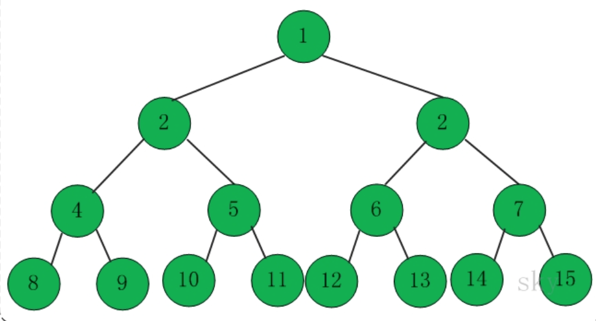

# 小橙编程学习宝典  
>
> ***XiaoCheng Programming Learning Book***
>

## 线性结构（线性表）

💬 描述： 除第一个元素外，每个元素有且仅有一个直接前驱。除最后一个元素外，每个元素有且只有一个直接后继。

- 顺序存储：顺序表
- 链式存储：链表

⭐线性枚举、前缀和、双指针、二分枚举、三分枚举、离散化

### 1. 顺序表

用**一组地址连续的存储单元**依次存储线性表的数据元素  
数组：列表的实现方式之一（**索引**）  
二维数组

时间复杂度：

- 读取元素：O(1) ===== 内存地址 + 索引
- 查找元素：O(n)
- 插入元素：O(n) ===== 末尾插入为O(1) 中间插入(频繁)：链表更佳
- 删除元素：O(n)

### 2. 字符串

KMP、字典树、马拉车、AC自动机、后缀数组、BM

1. 比较字符串： == | equals | compareTo  

    ```Java
    // 定义 s1、s2、s3
    String s1 = "Hello World!";
    String s2 = s1;                 // 将 s1 的引用值赋给了 s2, 指向同一个对象
    String s3 = new String(s1);     // 重新创建了一个对象，在内存中地址不同，值内容相同

    // ① 使用 "==" 比较 (内存地址，是否指向同一对象)
    s1 == "Hello World";        // true
    s1 == s2;                   // true
    s1 == s3;                   // false⭐

    // ② 使用 "equals()" 方法比较 (仅比较值)
    s1.equals("Hello World");   // true
    s1.equals(s2);              // true
    s1.equals(s3);              // true

    // ③ 使用 "CompareTo()" 比较（两个字符串的字典顺序）
    s1.compareTo("Hello World") == 0);  // true
    s1.compareTo(s2) == 0);             // true
    s1.compareTo(s3) == 0);             // true
    ```

    总结：
    - ① "=="比较 **字符串** 比较的是其内存的地址值，  
    对于**基本数据类型**(int,char) 比较值是否相等。  
    - ② "equals()"比较，在Object类中  <u>默认也比较的是内存地址</u>，  
    但在许多类(String、Integer、Date)中重写了，只用来比较 值是否相同。  
    - ③ "CompareTo"比较 是字符串的字典顺序，相同为0，  
    a.CompareTo(b),若a在b前，返回负值，反之返回正值。
    - ④ **str1.equlasIgnoreCase(str3)** 不考虑大小写  

2. 连接字符串  
    使用 **toCharArray** 转换为字符数组，字符串可变  
    如果经常连接字符串，使用 **StringBuilder** 数据类型  
    str1.concat(str2);
3. 查找字符串  
    .indexOf("a"); 首次出现的索引
    .lastIndexOf("a"); 最后一次出现的索引
4. 获取指定位置的字符串  
    .charAt(3);
5. 其他  
   - .substring(2,4) 截取子串
   - .startWith("ab", 1) 判断字符串的开始与结尾(end)
   - .parseInt(s); .parseLong(s);
   - .valueOf(s).intValue(); 转换
   - .split(" ", 2) 分成两份
6. 字符数组、byte数组、字符串
   - char mychar[] = s.toCharArray();
   - byte[] Str2 = s.getBytes();
7. StringBuffer
   - .append
   - .delete(0, 1) 删除下标 0到1
   - .deleteCharAt(str, length()-1) 删除最后一个字符
   - .reverse() 反转字符串
   - .insert(1,2) 在索引为1的位置插入一个 字符型的 2
   - .setLength(4) 设置字符串长度
   - .capacity() 获取当前容量

### 3. 链表

#### 单向链表

一组任意的存储单元，可连续可不连续  
**结点**：包括 数据域 / 指针域  
> 头指针L ---> 头结点(不存数据) ---> 首元结点

顺序表和链表的区别：  

   1. 空间性能
    - **存储空间分配**： 顺序表要预先分配空间还有个数限制，链表没有
    - **存储密度**： 链表要设置额外的指针域，存储密度低 <1，顺序表密度=1
   2. 时间性能
    - **存取元素效率**：顺序表是 随机存取 效率高，链表是顺序存取，取值一般用顺序表（R）
    - **插入和删除元素效率**：频繁插入或删除适宜用链表（I、D）

#### 双向链表

既可以从头又可以从末尾开始遍历  
  
左指针 指向上一个结点的 数据  
右指针 指向下一个结点的 数据

#### 循环链表

  
尾结点的指针指向了 **头结点**(没有数据的)  
特点：  

- 可以从任意结点出发，访问到链表的全部结点
- 带有头结点的循环链表，为空链表时，头结点的指针域指向自己
- 带有头结点的循环链表，为非空链表时，终端结点指针域指向头结点

插入：  
在 cur和cur->next 结点中间插入  
第一步：将插入结点的指针指向 cur->next 结点的data  
第二步：将 cur 结点的指针指向插入节点的data  
⭐循序一变，就找不到cur->next了

删除：  
直接找到要删除结点n的前一个结点，让其指向下一个结点的下一个结点

### 4. 栈（后进先出）

#### 顺序栈

只允许在一段插入或删除的线性表  
  

#### 链栈

  
栈空：头指针指向Null  


#### 共享栈（两栈共享空间）

  
栈空：两栈都向两边收缩，左栈top=-1，右栈top=MaxSize  
栈满：两栈都向中间挤压，当top0 + 1 = top1，相遇

### 5. 队列

#### 顺序队列（先进先出FIFO）

需要队头指针（front）和队尾指针（rear）  
假溢出：  
再在E的上方插入元素F，会超过队列最大长度，但并未全部占慢  
  

#### 循环队列（解决假溢出）

头尾相接：  
  

为判断 循环对列为空或满，要牺牲一个存储空间  

- 队满（Q.rear+1）%MAXSIZE==Q.front； front在rear的下一位置
- 队空 Q.rear==Q.front；在同一位置

#### 双端队列

两端都进行入队和出队

#### 链队列

将队头指针指向链队列的头结点，而队尾指针指向终端结点  
  

队列空：front==rear

---

## 散列结构

💬 描述：一种为保证增删效率和查询效效率的数据结构（数组+链表）  

1. 散列表（Hash表）：散列中的数组
2. 散列函数（Hash函数）：用来计算一个元素应该存放在Hash表中哪个位置（取余法/模地址法）
3. Hash碰撞/冲突： 两个数据计算出再hash表中位置相同
4. Hash桶：为解决hash碰撞产生了hash桶，一个hash桶中存储了所有发生hash碰撞的元素，链表就是hash桶的一种实现方式（链地址法，拉链法）

哈希冲突解决方法：  

   1. 开放定制法（线性探测再散列、平方探测再散列、双探测再散列）
   2. 链地址法
   3. 公共溢出区法
   4. 再散列法

Hash表的删除：  
&emsp;&emsp;链地址法可直接删除元素，开发地址法不行，应该删除后放入一个不存在的数据（-1）

## 集合与映射

### 集合

💬 描述：具有某种特性的事物的整体，一种不允许值重复的顺序数据结构  
特性： 无序性、互异性、确定性

### 映射

💬 描述：集合与集合之间的一种对应关系，用来存储键值对  
**映射的实现通常使用哈希函数来快速定位键对应的值**

特点：键唯一性、灵活的键类型  
映射的应用场景：

- 数据库索引： 数据库查询中常使用映射来加速查找操作。
- 缓存管理： 映射可以用于缓存管理，加快对热门数据的访问。
- 配置存储： 映射可以用于存储配置项和参数。

映射的优势：

- 快速查找： 映射通过键快速查找对应的值，具有高效的查找速度。
- 数据关联性： 映射可以用于存储具有关联关系的数据。

### 位图 (BitMap)

💬 描述：用每一位来存放某种状态，适用于大规模数据，但数据状态又不是很多的情况，用来判断某个数据存不存在。  

用数组实现，0表示存在，1表示不存在  

是一种 **直接定址法** 的哈希

---

## 树

### 1. 二叉树

每个节点最多两个子树，可为空集(左右节点)

- 性质1：二叉树第i层上的节点数目最多为 2^{i-1} (i≥1)
- 性质2：深度为k的二叉树至多有2^k-1个节点（k>=1）
- 性质3：包含n个节点的二叉树的高度至少为log2 (n+1)
- 性质4：在任意一颗二叉树中，若终端节点的个数为n0,度为2的节点数为n2，则n0=n2+1  



分类：

- 满二叉树
- 完全二叉树 （最下层节点可小于2，节点全靠左）
- 二叉搜索树 （左小右大）
- ⭐平衡二叉搜索树(AVL) ：（左右子树高度差绝对值不超过1）

链式存储(左右指针)、顺序存储(数组存储)  
**深度优先**：前序遍历、中序遍历、后序遍历  
**广度优先**：层次遍历(迭代法)  

### 2. 字典树（前缀树）

3个基本性质：  

- 根节点不包含字符，除根节点外每一个节点都只包含一个字符。
- 从根节点到某一节点，路径上经过的字符连接起来，为该节点对应的字符串。
- 每个节点的所有子节点包含的字符都不相同。


### 3. 堆(Heap)

堆是一棵完全二叉树，某个节点的值不大于或不小于其父节点的值

小顶堆：父节点比子节点值小  
大顶堆：父节点比子节点值大

堆的插入：  
先挂在到树的子节点尾部，判断大小，逐层交换  
堆的删除：  
取出最后一个元素放到以及被删除的顶部位置，再判断大小进行交换

### 4. 线段树

### 5. 霍夫曼树

### 6. 红黑树

### 7. 伸展树

### 8. Treap

### 9. B+树

### 10. 左偏树

### 11. 树链剖分

---

## 图

### 1. 最短路径

- 迪杰斯特拉算法(贪心算法)

使用 **广度优先搜索** 解决赋权有向图或者无向图的单源最短路径问题  
  
  


- 弗洛伊德算法（Floyd）

使用两个二维矩阵，画十字，每次更新值后取对角线下一元素：  
十字中以及其中无穷值对应的行和列不用更新，剩下的相加值更小才更新

```Txt
1. 矩阵D记录顶点间的最小路径  
例如D[0][3] = 10，说明顶点 0 到 3 的最短路径为10；

2. 矩阵S记录顶点间最小路径中的中转点
例如S[0][3] = 1 说明 0 到 3的最短路径轨迹为：0 -> 1 -> 3。
```

  
  

### 2. 并查集

支持两种操作：  

- 合并（Union）：把两个不相交的集合合并为一个集合。
- 查询（Find）：查询两个元素是否在同一个集合中。

类比成帮派，代表元素位帮主,有事找帮主(根节点)  
  

**路径压缩**： 变成一个链效率较低，使 **每个结点的父节点都设成根节点**  
**按秩合并**： 让秩小的树依附到秩大的树上  

秩(rank): 子节点个数

### 3. 最小生成树

有n个顶点的无向完全图最多包含 n的(n-2)次方颗生成树  

Kruskal克鲁斯卡尔算法： （贪心算法）  
先分开，再合并  
先将所有 **边** 按照权值非降序排列，选择权值最小的边，无环形成则一直连接，直到连接全部节点或n-1条边

Prim普利姆算法：  （贪心算法）  
起点出发，每次寻找权值最小的点加入 **整体**，再看连接这个整体的节点权值最小，加入。

### 4. 拓扑排序

一个 **有向无环图DAG** 的所有顶点的线性序列  
满足：  

- 每个顶点出现且只出现一次。
- 若存在一条从顶点 A 到顶点 B 的路径，那么在序列中顶点 A 出现在顶点 B 的前面。

常用方法：  
选一个没有前驱(入度为0)的顶点输出并删掉其和其边，重复  


### 5. 最近公共祖先

### 6. 强连通分量

### 7. 双连通分量

### 8. 二分图

### 9. 2-sat

### 10. 欧拉回路

### 11. 哈米尔顿回路

### 12. 迭代加深

### 13. A*

### 14. 稳定婚姻

### 15. 双向广索

### 16. 差分约束

### 17. 跳跃表

### 18. 树状数组

### 19. 最大流

---

## 算法

### 排序

- ①冒泡排序  
   比较相邻的元素，交换，重复多轮  
- ②快速排序  
   指定一个base(一般为第一个数)，定义左右指针(l,r)，右指针r->左寻比base小的数并与l交换，  
   再左指针l->右寻大于base的数并与r交换，直至l与r指向同一个数，再替换为base，第一轮结束
- ③插入排序  
   构建有序序列，对于未排序序列，在已排序中从后向前扫描，在合适位置插入
- ④希尔排序(缩小增量法)  
   分组思想，取gap=5值分5组，在每组中进行直接插入排序，并每次减小gap值。  

   
- ⑤选择排序  
   在未排序中找最小，放到起始位置，再在剩余未排序中找最小拍到已排序的末尾
- ⑥堆排序
   堆(近似完全二叉树)  
   》子节点的键值总小于或大于父节点  
   》大根堆：升序 ======= 小根堆：降序  
   基本思想:
   > 将待排序的数组构造大根堆，顶端即为最大值  
   > 与末尾的数交换  
   > 再将剩余的n-1个数再构造成大根堆，并与末尾的交换。

- ⑦归并排序  
   将未排序序列从中间分为2部分，再分为4部分，直至为一个一个的数据，再两两归并，并排序

- ⑧计数排序  
   先找到无序数组的最大值与最小值，并申请额外空间（max-min+1）  
   按照无序数组的数值与额外空间的下标一致，每次+1

- ⑨桶排序(计数排序pro)  
   确定数组元素分布范围，分出n个桶，区间依次为[0-9]、[10-19]等  
   将元素放入桶中并进行排序，最后依次输出

- ⑩基数排序  
   准备10个桶(0-9)，按照数组中元素 个位 的值，入桶并排序

---

### 贪心

选取局部最优解

### 分治

分治思想，分而治之  
用于二分搜索、合并排序、快速排序、汉诺塔

### 动态规划

拆分子问题，记住过往，减少重复计算。  
1+1+1+1=4  左边加一个1+ 变成5  
记住求过的解来节省时间
<=>经典问题：青蛙跳台阶  

```js
f（10） = f（9）+f(8)
f (9)  = f(8) + f(7)
f (8)  = f(7) + f(6)
...
f(3) = f(2) + f(1)

// 即通用公式为: f(n) = f(n-1) + f(n-2)
```

递归耗时，存在大量重复计算，使用动态规划(带备忘录)  
一般使用一个数组或者一个哈希map充当这个备忘录

```Java
//先判断有没计算过，即看看备忘录有没有
if (tempMap.containsKey(n)) {
    //备忘录有，即计算过，直接返回
    return tempMap.get(n);
} else {
    // 备忘录没有，没有计算过，执行递归计算,并把结果保存到备忘录map中，对1000000007取余（题目规定）
    tempMap.put(n, (numWays(n - 1) + numWays(n - 2)) % 1000000007);
    return tempMap.get(n);
}
```

### 递归

### 回溯

从一条路往前走，能进则进，不能进则退回来，换一条路再试，从而搜索到抵达特定终点的一条或者多条特定路径。

### 枚举

### 线性DP

### 树形DP

### 区间DP

### 数位DP

### 状压DP

### 记忆化搜索

### 背包问题

### 


---

### 查找

#### 顺序查找

从数组的头部开始顺序查找，如果找到目标元素，就返回目标元素的位置，如果没有找到，返回 -1.

##### 二分查找

该数组元素 **有序**,每次分两半，左小右大，如果在数组内找到元素，返回元素的位置，否则返回 -1

#### 分块(索引顺序)查找

额外建立一个“索引表”，将查找表分为若干子表（或称块），对每个子表建立一个索引项，其中包含两项内容：关键字项（其值为该子表内的最大）和指针项（指示该子表的第一个记录在表中的位置）。每个索引项构成一个索引表，索引表按关键字有序排列。  

 
#### 树结构查找

二叉树查找，左子树小，右子树大

#### 散列表查找

使用哈希函数，和开放地址法等查找

---

### 搜索

#### 深度优先搜索 DFS

#### 广度优先搜索 BFS

-

### 字符串匹配

#### KMP

核心是利用匹配失败后的信息，尽量减少模式串与主串的匹配次数以达到快速匹配的目的  
时间复杂度是 O(m+n)  
  
字符串P有字串 `ACT` 和 `ACY`，当T与Y不匹配时，可能匹配左边的AC，就从j的位置开始比较  

构造next数组，存储，P字符串的 最长公共前缀后缀长度，且next[0]=-1

发现两个字符不匹配，立即移动到 next数组下表的位置

#### 算法-前缀树（Trie树）

根节点不包含字符，将根节点到某一结点路径上经过的字符连接起来就是对应的字符串
