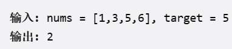
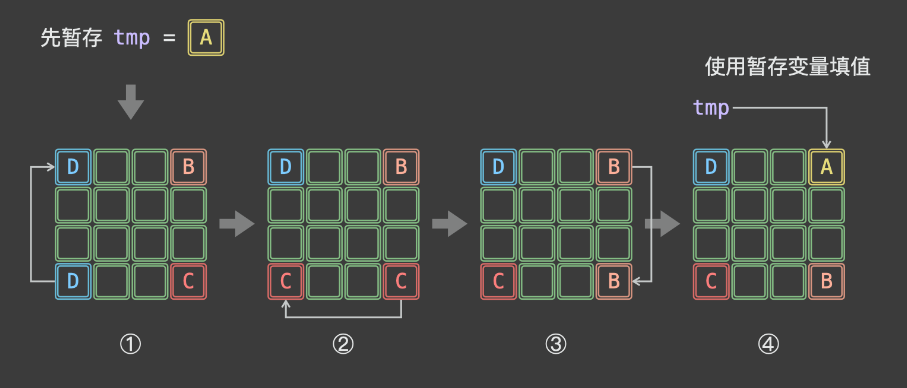
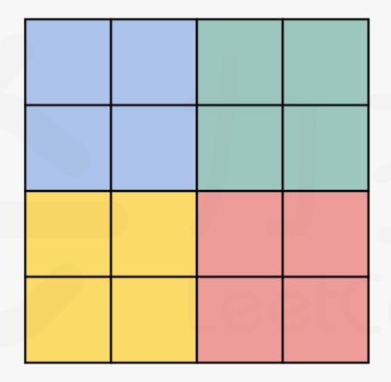
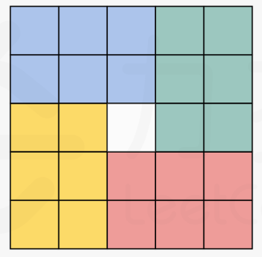
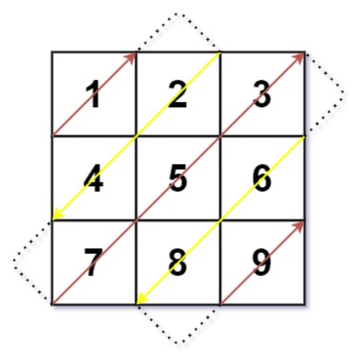

# 小橙编程学习宝典  
>
> ***XiaoCheng Programming Learning Book***
>

## 经典算法题集锦

### 数组和字符串

1. 寻找数组的中心索引

    ```Java
    public int pivotIndex(int[] nums) {
      int presum = 0;
      //前缀和
      for (int x : nums) {
         presum += x;
      }      
    
      int leftsum = 0;
      for (int i = 0; i < nums.length; ++i) {
          //根据  2 * 左 + 中 = 前缀和
          if (2*leftsum + nums[i]== presum){
              return i;
          }
          // 左边逐步增加
          leftsum += nums[i];          
      }
      return -1;}
    ```

    **总结：**  

    找规律，中心索引符合：（ 左 + 中 + 右 = All） 且 左 = 右  
    只需计算（ 左 和 All ）即可获得 中

    ---

2. 搜索插入位置(二分查找法) ====> 已排好序的  
&emsp;&emsp;给1个排序数组和个1目标值，在数组中找到目标值，并返回其索引。如果目标值不存在于数组中，返回它将会被按顺序插入的位置。  
&emsp;&emsp;⭐️必须使用时间复杂度为 O(log n) 的算法。  


    ```Java
    1. 暴力解法：   不满足时间复杂度为O(log n)  此乃线性搜索
    public int searchInsert(int[] nums, int target) {
        // 从左往右比较，若目标数更小，则返回此位置的下标 i
        for (int i = 0; i < nums.length; i++){
            if (target <= nums[i]) return i;
        }
        // 若目标树最大，拍到最后，则返回数组长度，相当于最后一位下标 +1
        return nums.length;    }

    2. 正经解法  二分查找法
    public int searchInsert(int[] nums, int target) {
        int left = 0;
        int right = nums.length - 1;
        
        while (left <= right) {
            // 计算中间值
            int mid = left + (right - left) / 2;
            if (nums[mid] == target) {
                return mid;
            } else if (nums[mid] < target) {
                left = mid + 1;
            } else {
                right = mid - 1;
            }
        }
        // 如果循环结束仍然没有找到目标值，那么返回left的位置，即应该插入的位置
        return left;    }
    ```

    **总结：**  
    利用二分查找法，计算mid值，mid小则把范围定在右，重新计算mid

    ---

3. 合并区间  
&emsp;&emsp;以数组 intervals 表示若干个区间的集合，其中单个区间为 intervals[i] = [starti, endi] 。合并所有重叠的区间，并返回 一个不重叠的区间数组，该数组需恰好覆盖输入中的所有区间 。

    ```Java
    public int[][] merge(int[][] intervals) {
        // 边缘判断
        if (intervals.length <= 1) return intervals;

        // 对原先数组排序
        Arrays.sort(intervals, Comparator.comparingInt(o -> o[0]));

        // 创建一个列表用于存储合并后的数据
        List<int[]> res = new ArrayList<>();

        res.add(intervals[0]);
        int last = 0;

        for (int i = 0; i < intervals.length; ++i) {
            int L = intervals[i][0], R = intervals[i][1];
            // 右 1 < 左 2 直接加
            if (res.size() == 0 || res.get(res.size() - 1)[1] < L) {
                res.add(new int[]{L, R});
            } 
            // 右 1 >= 左 2 需要合并
            else {
                // 排序完 左 1最小 固定，取（右1，右2）最大
                res.get(res.size()-1)[1] = Math.max(res.get(res.size()-1)[1],R);
            }
        }
        return res.toArray(new int[res.size()][]);
    }
    ```

    **总结：**  
    先排序将L确定
    再确定最简单的不需要合并的情况 （右1 < 左2）  直接添加  
    最后需要合并的 取右边更大的一个  更改值

    ---
4. 二维数组---原地旋转矩阵  
    &emsp;&emsp;一幅由 N × N 矩阵表示的图像，其中每个像素的大小为 4 字节。请将图像旋转 90 度。  
    ⭐不占用额外内存空间能否做到？

    ```Java
    // 1. 基本思路（占用了额外内存空间）
    public void rotate(int[][] matrix) {
            int n = matrix.length;
            
            // 使用新的二维数组来存储
            int[][] matrix2 = new int[n][n];
            for (int j = 0; j < n;j++) {
                for (int i = n - 1; i >= 0;i--) { 
                    // 0 -> 2; 1 -> 1; 2 -> 0;总结出 (n-1-i)
                    matrix2[j][n - 1 - i] = matrix[i][j];}}
            // 将旋转后的矩阵拷贝回原矩阵
            for (int i = 0; i < n; i++) {
                // 将matrix2 数组的第 i 行复制到 matrix 数组的第 i 行，复制的长度为 n
                System.arraycopy(matrix2[i], 0, matrix[i], 0, n);}
        }

    // 2. 翻转代替旋转
    public void rotate(int[][] matrix) {
            int n = matrix.length;
            ⭐// 主对角线翻转
            for (int j = 0; j < n;j++) {
                for (int i = j; i < n; i++) {
                    // 先保存原来的数据
                    int temp = matrix[j][i];
                    // 仅反转 i与j, [00,01,02] --> [00,10,20] 还需行内反转
                    matrix[j][i] = matrix[i][j];
                    // temp 再重新赋值给竖着的
                    matrix[i][j] = temp;}}
            ⭐// 水平翻转
            // 将每一行的元素进行反转,对称，只进行一半就可以
            for (int i = 0; i < n; i++) {
                for (int j = 0;j < n / 2; j++) {
                    int temp = matrix[i][j];
                    matrix[i][j] = matrix[i][n-1-j];
                    matrix[i][n-1-j] = temp;}}
        }

    // 3.改进---原地旋转
    public void rotate(int[][] matrix) {
            int n = matrix.length;
            // n为偶数，取 n/2 做起始点
            for (int i = 0; i < n / 2; ++i) {
                // n为奇数，取 (n+1)/2 做起始点
                for (int j = 0; j < (n + 1) / 2; ++j) {
                    // 5个公式完成闭环
                    int temp = matrix[i][j];
                    matrix[i][j] = matrix[n - j - 1][i];
                    matrix[n - j - 1][i] = matrix[n - i - 1][n - j - 1];
                    matrix[n - i - 1][n - j - 1] = matrix[j][n - i - 1];
                    matrix[j][n - i - 1] = temp;    }}
        }
    ```

    

    分块内部反转再移动到相应位置：  
     ======== 

5. 零矩阵  
    编写一种算法，若M × N矩阵中某个元素为0，则将其所在的行与列清零。

    ```Java
    public void setZeroes(int[][] matrix) {
            int m = matrix.length, n = matrix[0].length;
            boolean[] row = new boolean[m];
            boolean[] col = new boolean[n];
            for (int i = 0; i < m; i++) {
                for (int j = 0; j < n; j++) {
                    if (matrix[i][j] == 0) {
                        // 对这一行或者这一列 标记
                        row[i] = col[j] = true;
                    }}}
            for (int i = 0; i < m; i++) {
                for (int j = 0; j < n; j++) {
                    // 属于标记的行或列就 置为0
                    if (row[i] || col[j]) {
                        matrix[i][j] = 0;
                    }}}
        }
    ```

6. 对角线遍历  
  

⭐m行就有m条, n列n条因为第1行算过了，就-1

- 共有m+n-1条对角线  对角线编号为i 属于（0, m+n-2）
  - i为偶数：从下往上遍历  
  - i为奇数：从上往下  

- 从下往上时：
  - 当 i < m 时, 该对角线遍历起点为 (i, 0)
  - 当 i >= m 时，起点为 (m-1, i-m+1)  
  &emsp;&emsp;⭐(m-1)即最后一行，(i-m+1)是 i 距离 m 即拥有元素最多的一条对角线的距离 + 1,因为m就在第1列
- 从上往下时：
  - 当 i < n 时, 起点为 (0, i)
  - 当 i >= n 时, 起点为 (i-n+1, n-1)

    ```Java
    // 第一种解法  常规
    public int[] findDiagonalOrder(int[][] mat) {
            int m = mat.length;
            int n = mat[0].length;
            int[] res = new int[m * n];
            // 存放在res的顺序
            int pos = 0;
            for (int i = 0; i < m + n - 1; i++) {
                // 条数为奇数，从上往下
                if (i % 2 == 1) {
                    int x = i < n ? 0 : i - n + 1;
                    int y = i < n ? i : n - 1;
                    while (x < m && y >= 0) {
                        res[pos] = mat[x][y];
                        pos++;
                        // 向左下继续遍历
                        x++;
                        y--;}} 
                else {
                    int x = i < m ? i : m - 1;
                    int y = i < m ? 0 : i - m + 1;
                    while (x >= 0 && y < n) {
                        res[pos] = mat[x][y];
                        pos++;
                        // 向右上
                        x--;
                        y++;}}       
            }
            return res;
        }
    // 第二种：根据 ⭐ (i = x + y) ,第 i条的 i就等于 该对角线上横纵坐标之和
    for (int i = 0, idx = 0; i < n + m - 1; i++) 
    {
        if (i % 2 == 0) //偶数对角线, 从下往上遍历
            for (int x = Math.min(i, m - 1); x >= Math.max(0, i - n + 1); x -- ) 
                res[idx++] = mat[x][i - x];
        else       //奇数对角线,从上往下遍历
            for (int x = Math.max(0, i - n + 1); x <= Math.min(i, m - 1); x ++ )
                res[idx++] = mat[x][i - x];
    }
    ```


    