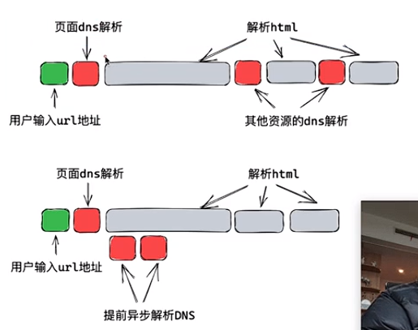
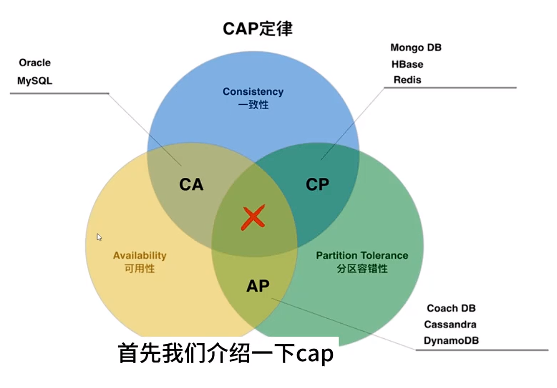

# 小橙编程学习宝典  
>
> ***XiaoCheng Programming Learning Book***
>

## 面试题目

### Java

1. HashMap的实现原理
2. A给B转账的同时B给A转账，怎么并发量最高
3. final关键字
4. 设计一个榨汁机类，面向对象怎么设计
5. Get、Post区别，使用场景，幂等性
6. TCP、UDP协议，分别在应用层有哪些协议
7. http的各种方法
8. http与https区别
9. https加密过程
10. 浏览器输入一个url生成页面发生了什么
11. Java多线程
12. Session与Cookie的区别
13. 介绍TCP
14. 状态码
15. 红黑树，怎么变成线程安全，锁机制
16. JVM
17. ReentrantLock和synchronized的异同
    区别：  
    ReentrantLock需要显示的 **获取锁** 和 **释放锁**，在JDK1.8版本两个效率基本持平

    - 1. 等待可中断；当持有锁的线程长时间不释放时，等待中的线程可选择 放弃等待，转而处理其他任务  
    - 2. 公平锁；ReentrantLock和synchronized默认都是非公平锁，但ReentrantLock可通过 **构造函数传参** 改变，但是使用公平锁会导致性能急剧下降  
    - 3. 绑定多个条件；ReentrantLock可以绑定多个Condition条件对象
    - 4. 用法不同；synchronized可以加在方法上，不需要指定锁对象（此时锁this），不需要显示解锁，ReentrantLock必须显示解锁，且解锁顺序不定
    相同点：  

    - 1. 用来同步
    - 2. 都保证了可见性
    - 3. 都是可重入的

---

### 数据库

#### 1. 普通

1. 存储引擎
    - InnoDB（MySQL默认）
        支持外键、事务、表锁和行锁、根据事务日志恢复、数据和索引集中存储(.ibd和.frm)、查询性能较差、聚簇索引
    - MylSAM
        不支持外键、事务、只支持表锁、无事务日志、数据和索引分开存储(数据.MYD 索引.MYI)、性能略高、非聚簇索引

2. 常见SQL优化
    - 出现慢SQL，一般多表联查，小表驱动大表
3. 三大范式
4. 数据类型

#### 2. 索引

1. 索引、索引优缺点、索引的数据结构、索引类型、使用场景  
    类型主要有：FULLTEXT、Hash、BTree、Rtree  
       - FULLTEXT： 全文索引，用于查找文本中的关键字，而非直接比较是否相等，解决WHERE name LIKE "%zhang%"等模糊查询效率低  
       - Hash： 哈希索引，用于等值查询，效率高，但不支持排序、范围查询及模糊查询  
       - BTree： B+树索引，InnoDB存储引擎默认索引、支持排序、分组、范围、模糊查询，性能稳定  
       - RTree： 空间数据索引、用于地理数据的存储，优势在范围查询

2. Hash索引和B+树的区别
3. B树和B+树
4. 聚簇索引和非聚簇索引
5. 非聚簇索引一定会进行回表查询吗
6. 索引的设计原则、又如何优化
7. 如何创建/删除索引
8. 使用索引查询性能一定会提升吗
9. 什么是前缀索引
10. 什么是最左匹配原则
11. 索引在什么情况下会失效

#### 3. 具体语句

1. count(*) 不一定比 count(1) 性能差
    count(*) = count(1) > count(主键字段) > count(字段)  
    &emsp;&emsp;InnoDB以相同方式处理count(*) 和 count(1)，性能没有区别  
    &emsp;&emsp;使用count(*)进行EXPLAIN分析和show WARNINGS; 显示会转换成count(0)，结果一样
2. count(字段) 有坑
    null值不会被记录上，只会统计有数据的字段
3. count(*)有性能问题，如何优化

    - 单独记录一个数量值
    - 使用EXPLAIN查询一个近似值，rows值只是mysql根据缓存数据的一个估算
4. 语句分为哪几类
5. 约束有哪些
6. 子查询
7. 连接查询
8. In和Exists的区别
9. varchar和char的区别
10. drop、delete、truncate区别
11. UNION和UNIONALL的区别
12. 临时表
13. 慢日志查询，慢查询，优化
14. 为什么要设置主键
15. 主键一般用自增ID还是UUID
16. 字段为什么要设置为 not null
17. SQL语句执行慢的原因、执行顺序

#### 4. 数据库事务

1. 事务是什么
2. 四大特性ACID
3. 并发一致性问题
4. 隔离级别
    可以解决数据的 脏读、不可重复读、幻读
   - 1. 未提交读：事务提交前，其修改对其他事务也是可见的 ====== 三个都允许
   - 2. 提交读：事务提交后，其修改才能被其他事务看到 ========= 不允许脏读
   - 3. 可重复读：在同一个事务中多次读取到的数据是一致的 ====== 允许幻读
   - 4. 串行化：需要加锁实现，会强制事务串行执行 ============ 三个都不允许
5. MVCC

#### 5. 数据库的锁

1. 什么是数据库的锁
2. 数据库锁和隔离级别之间的关系
3. 锁的类型
4. InnoDB引擎的行锁模式、如何实现的
5. 什么是乐观锁、悲观锁、怎么实现
6. 什么是死锁、怎么避免

#### 6. 数据库优化

1. 大表如何优化
2. 什么是垂直分表、垂直分库、水平分表、水平分库
3. 分库分表后，ID键怎么处理
4. MySQL的复制原理和流程，如何实现主从复制
5. 读写分离
6. 如何优化数据查询中的数据访问  
    - 减少数据访问： 正确使用索引（索引覆盖）、优化SQL执行计划  
    - 返回更少数据： 数据分页处理、只返回需要的字段  
    - 减少服务器CPU开销：合理使用排序、减少比较的操作、复杂运算在客户端处理
    - 增加资源： 客户端多线程进行访问、数据库并行处理
7. 如何优化长难的查询语句
8. 如何优化LIMIT分页、UNION查询、WHERE语句

---

### 前端

#### 1. DNS解析和优化

域名解析： 域名 ---> (DNS) ---> Ip地址

- 转换过程是一个 “耗时” 操作
- 有缓存，后续访问使用缓存

优化： 主要优化第一次访问的耗时问题  
&emsp;&emsp;在解析页面时，发现外部链接要请求数据，比较耗时  

解决方法： 将后面的解析提前，刚开始渲染页面时预先步做DNS解析  

使用工程化工具适配所有脚手架工具  

- Vue-cli: wabpack  
- Vite: rollup  
- cra: webpack (React)

思想：在打包结果中进行操作，最后打包的结构肯定都HTML、CSS和JS，分析打包结果中的外链接，提取出来  

在Node环境中运行，需要一个node-html-parse库，打时运行：  
package.json修改为： ⭐build:" vite build &&node ./dns-prefetch.js"  
[DNS预加载](dns-prefetch.js")

#### 2. 浏览器同源策略，跨域

跨域问题的产生：由于浏览器的一个安全策略 --- **同源策略**  
> 当一个请求是跨域的,大部分情况下正常发送请求到服务器，服务器响应到浏览器进行校验，校验通过交给Js，不提供就报错

解决办法：搞清楚校验规则 --- CORS规则（Cross-Origin Resource Sharing）  
CORS基本理念：只要服务器的响应中明确表示允许，就通过，否则不通过  

CORS将请求分为两类: 简单请求 =|= 预检请求  

- 简单请求：（头部自带一个Orgin: 代表源 后面加上页面）
  - ①请求方法为GET、HEAD、POST
  - ②头部字样满足CORS安全规范
  - ③ 请求头Content-Type为：
    - text/plain
    - multipart/form-data
    - application/x-www-form-urlencoded
- 预检请求：不满足上三个条件、使用第三方库（内部封装修改了Content-Type）

#### 3. 性能优化-gzip压缩

安装vite-plugin-comporession插件  
对资源文件生成 .gz结尾的压缩文件  
在nginx.conf配置中加上gzip的相关配置即可

#### 4. Vue

1. v-if和v-show区别  
    > v-if : 插入或删除元素  
    > v-show : 通过隐藏==display:none  
    > **比较**：  
    > 1.v-if安全级别更高，v-show只是隐藏，通过源代码看得到  
    > 2.v-if 有更高的切换消耗 ===== v-show 有更高的初始化渲染消耗
2. v-if和v-for的优先级
3. Vue组件如何和iframe通信
4. Vue生命周期
5. Vue怎么实现单页面应用SPA
6. Vue路由实现的底层原理
7. Vue的Template编译过程
8. Vue中为什么用虚拟DOM而不操作真实的DOM
9. 双向数据绑定是什么
10. Vue组件之间通信方式
11. 为什么data属性是一个函数而非一个对象
12. 动态给vue的data添加一个属性时会发生什么
13. 使用哪种设计模式
    发布/订阅模式，vue中使用Observer和Definereactive两个方法的结合对数据进行 **递归劫持**，然后通过 **watch** 这个类对属性进行订阅，Dep类用于解耦，数据变更时先触发数据的set方法，然后调用Dep，notify通知视图更新
14. Vue中key的原理
15. Vue的mixin的理解
16. Vue常用的修饰符
17. Vue的$nextTick作用
    nextTick先尝试使用promise、MutationObserver、setimmediate这些技术监听，都不支持采用setTimeout
18. Vue实力挂载过程
19. Vue的diff算法
20. Vue的组件和插件的区别
21. 如何解决跨域
    源于同源策略，要满足：协议相同、主机相同、端口相同  
    解决办法：JSONP、CORS、Proxy
22. 自定义指令
23. 过滤器
24. Vue项目中有封装过axios吗？主要封装哪方面的
25. 怎么处理Vue项目中的错误
26. axios的原理
27. Vue的权限管理
28. Keep-alive的理解
    在组件切换时，保存其包裹的组件的状态，使其不被销毁，防止多次渲染
29. SPA首屏加载数度慢怎么解决
30. SSR解决了什么问题
31. Vue2与Vue3的区别
32. 父子通信
    父 -> 子：通过Prop向子组件传递数据，子组件通过props来接受  
    子 -> 父：父组件自定义事件，子组件利用 $emit来完成
33. Vue的导航守卫和jq导航拦截器

#### 5. vue中的性能优化

遇到性能问题怎么解决，前端展示后台数据慢怎么解决

1. 首屏加载优化
2. 路由懒加载处理
3. 开启服务器Gzip
4. 启动CDN加速
5. 代码层面优化
6. Webpack对图片进行压缩
7. 避免内存泄漏
8. 减少ES6转为ES5的冗余代码

#### 6. 虚拟DOM和原生DOM

#### 9. Node.js

优缺点、应用场景  

非阻塞异步  
事件驱动

#### 10. Webpack

模块化

#### 11. 简单

1. var和let的区别

- 全局污染  
    var定义一个对象a ，会造成全局污染，全局变量window上就多一个变量a  
    let和var都可以 **跨越标签** 来使用
- 块级作用域
    var有两个作用域，全局和函数
- TDZ 暂时性死区
    var没有暂时性死区（不报错但是值为undifined），let有（声明之前无法访问这个变量 ）

#### 12. 如何理解 JS 的异步？

1. JS是⼀门单线程的语言，渲染主线程只有⼀个，渲染⻚⾯、⾏JS 都在其中运⾏。  
2. 如果使⽤同步的⽅式，就极有可能导致主线程产⽣阻塞，从⽽致消息队列中的很多其他任务⽆法得到执⾏。
3. 浏览器采⽤异步的⽅式来避免。当某些任务发⽣时，⽐如计器、⽹络、事件监听，主线程将任务交给其他线程去处理，⾃身⽴结束任务的执⾏，转⽽执⾏后续代码。当其他线程完成时，将事先递的回调函数包装成任务，加⼊到消息队列的末尾排队，等待主线调度执⾏。  
4. 在这种异步模式下，浏览器永不阻塞，从⽽最⼤限度的保证了线程的流畅运⾏。  
5. 任务没有优先级，但是消息队列有优先级
       - 延时队列：⽤于存放计时器到达后的回调任务，优先级「中」
       - 交互队列：⽤于存放⽤户操作后产⽣的事件处理任务，优先级「⾼」
       - 微队列：⽤户存放需要最快执⾏的任务，优先级「最⾼」

#### 13. Js的计时器不能做到精确计时

1. 计算机硬件没有原⼦钟，⽆法做到精确计时
2. 操作系统的计时函数本身就有少量偏差，由于 JS 的计时器最终调⽤的是操作系统的函数，也就携带了这些偏差
3. 按照 W3C 的标准，浏览器实现计时器时，如果嵌套层级超过 5 层，则会带有 4 毫秒的最少时间，这样在计时时间少于 4 毫秒时⼜带来了偏差
4. 受事件循环的影响，计时器的回调函数只能在主线程空闲时运⾏，⼜带来了偏差

---

### 大数据

#### 1. Hadoop

1. Hadoop常用端口号
2. Hadoop配置文件和简单的Hadoop集群搭建
3. HDFS读流程和写流程
4. HDFS小文件处理
5. Shuffle及优化
6. Yarn工作机制
7. Yarn调度器
8. 项目经验之基准测试
9. Hadoop宕机
10. Hadoop解决数据倾斜方法
11. 集群资源分配参数

#### 2. kafka

1. kafka架构
2. kafka机器数量
3. 副本数设定
4. Kafka压
5. Kafka日志保存时间
6. Kafka中数据量计算
7. Kafka硬盘大小
8. Kafka监控
9. Kafka分区数
10. 多少个Topic
11. Kafka的ISR副本同步队列
12. Kafka分区分配策略
13. Kafka挂掉
14. Kafka丢不丢数据
15. Kafka数据重复
16. Kafka消息数据积压，消费能力不足
17. Kafka参数优化

#### 3. Hive

1. Hive的架构
2. Hive和数据库比较
3. 内部表和外部表
4. 4个By区别
5. 系统函数
6. 自定义函数UDF、UDTF函数
7. 窗口函数
8. Hive优化
9. Hive解决数据倾斜方法
10. Hive里面字段的分隔符用\t，为什么用\t，字段里有怎么办
11. Tez引擎优点
12. MySQL元数据备份
13. Union与UnionAll区别

#### 4. SparkStreaming

1. 第一次运行不丢失数据
2. 精准一次消费
3. 控制每秒消费数据的速度
4. 背压数据
5. 一个stage耗时
6. 优雅关闭
7. 默认分区个数
8. 有哪几种方式消费Kafka中的数据，区别是
9. ⭐窗口函数的原理

#### 5. Sqoop

1. Sqoop参数
2. Sqoop导出导入Null存储一致性问题
3. Sqoop数据导出一致性问题
4. Sqoop底层运行的任务是什么
5. Sqoop一天导入多少数据

#### 6. Linux和Shell

1. Linux常用高级命令
2. Shell常用工具及写过的脚本
3. Shell中提交了一个脚本，进程号已经不知道了，但是需要kill掉怎么操作
4. shell中单引号和双引号区别

#### 7. Flink

1. 简单介绍Flink
2. Flink跟Spark Streaming的区别
3. Flink集群有那些角色，各自有什么作用
4. 公司怎么提交的实时任务，有多少Job、Manager
5. Flink并行度，怎样设置的
6. Flink的CheckPoint存在哪里
7. Flink的三种时间语义
8. Flink中的窗口
9. Exactly-Once的保证
10. 说一下Flink状态机制
11. Flink中的Watermark机制
12. Flink分布式快照的原理
13. Flink的CEP机制
14. Flink CEP编程中当状态没有到的时候将数据保存在哪里

---

### 其他

#### 1. CAP原则

C --- Consistency 一致性  
A --- Availability 可用性  
P --- Partition Tolerance 分区容错性  
⭐通常一个分布系统 / 服务 / 中间件 不能同时拥有这个特性

**分布式系统最基本能力**：P  
P：系统出现数据丢失或故障，仍要对外提供正常访问（从结构）
C：所有的节点同一时间的数据要一样（写后所有系统要一，写失败则读失败）  
问题： 写操作过程，要对外上锁保护，主从同步完后，放锁  
A：读写操作在任何情况都要成功（要保证可用性，但可会出现数据不一致）  

主从节点间同步只能采取: 异步请求(同步过程中不能上锁、阻塞)

#### 2. SpringBoot跨域同时处理多少请求

通过配置内嵌的Tomcat的线程池的参数，控制请求的数量  
文件application.yaml中  

- threads.min-spare ====== 最小线程数（厨师）
- threads.max ========== 最大线程数（加上兼职厨师）
- max-Connections: 30 ==== 最大连接数（最大可容纳客户）  
- accept-count: 10 ======= 最大等待数（满员时，最多排队数）

#### 3. 动态代理

1. 静态代理  
    目标类 ====== 代理类 ====== 调用  
    （老板 ====== 小秘书 ====== 员工）  

    目标类 ：负责核心业务代码：CRUD  
    代理类 ：主要执行非业务代码：
    - 请求用时记录
    - 开启鉴权
    - 异常处理

    缺点：
    - 编译器确定代理，无法运行时动态新增
    - 无法代理全部方法(需要一个员工方法代理)
    - 一个目标类就需要一个代理类(代码冗余)

2. 动态代理  
    类似于 人力公司，会在运行时动态生成代理class字节码  
    主要有 JDK 和 CGLib 两种  
    - JDK  
        JDK需要实现接口目标类（反射调用）
    - CGLib  
        不能用Final修饰，生成的class继承自目标类（实时调用）

    在JDK1.8前CGLib略快，JDK1.8之后对反射进行性能优化，不相上下  
    Spring AOP根据目标类动态选择

#### 4. 容器与传统虚拟机

**VPS**：物理机分割为多个虚拟机，拥有独立的资源(CPU、内存、存储空间、公网Ip地址), &emsp;&emsp;&emsp;资源预先分配，不易动态调整  
**ECS**：( 弹性计算服务 ) 加了**自主升降级**功能  
**Docker容器**：跨平台，只打包软件和系统依赖库+配置，利用NameSpace看起来像是独立 &emsp;&emsp;&emsp;&emsp;&emsp;&emsp;操作系统，利用Cgroup限制可以使用的操作资源  

#### 5. 为什么SpringBoot的jar可以直接运行

- SpringBoot中提供了一个插件spring-boot-maven-plugin用于把程序打包成一个可执行的jar包  
- SpringBoot打包后生成一个Fat jar（jar包中包含jar包），包含了应用依赖的jar包和SpringBoot loader相关类  
- java -jar 会去找jar中的manifest文件，在此指定了真正的启动类  
- Fat jar启动Main函数是 **Jar Launcher**，负责创建一个 **LauncherURLClassLoader** 来加载 **boot-lib** 下面的jar，并以一个线程启动应用的启动类的Main函数（找到Manifest文件在的Start-Class属性，去运行指定的启动类）
